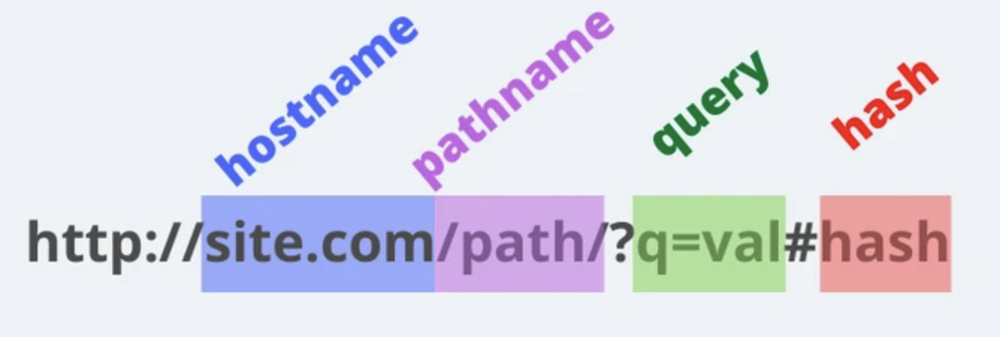

이번 토요일에 응시 예정인 프로그래머스 FE 데브매칭 테스트에 앞서 이전 과제들을 풀어보는 시간을 가졌다. 이 과제는 Vanilla JavaScript, Html, css 만을 활용해 요구사항을 구현하는 과제이다. 너무 오랜만에 Vanilla JavaScript 만을 활용해 구현하다보니 구현에 어려운 지점들이 종종 있었다. 그래도 작년 부스트캠프 6기에서 고민했던 경험들이 생각나서 좋았던 것 같다.

이번 과제에서는 컴포넌트 설계, 라우터, 이벤트 핸들링 등 여러 가지 사항을 고민하고 해결했다. 그리고 마지막에는 3시간이라는 제한적인 시간 내에서 효율적인 과제 구현을 위한 고민과 해결도 정리해봤다.

이 글은 해당 과제에 대한 내용을 알고 있다는 것을 전제로 작성했으므로 문제 내용을 모른다면 이해에 어려움이 있을 것 같다. [문제](https://programmers.co.kr/skill_check_assignments/199)를 이해하거나 풀어보고 오면 좋을 것 같다.

## 1. 스크립트 및 파일 불러오기

어플리케이션의 크기가 커지면 이를 파일로 분리해야한다. 이 때 이 파일을 모듈(module)이라고 한다. 브라우저 환경에서 일반 스크립트가 아닌 모듈 단위의 파일을 사용하기 위해서는 다음과 같이 작성해야한다.

```jsx
index.html

//...
<head>
  <title>커피캣 스토어</title>
  <link rel="stylesheet" href="styles.css">
  <script src="index.js" type="module" defer></script>
</head>
//...
```

여기서 `defer` 를 작성하여 모듈 로드가 HTML 파싱 과정을 멈추지않게 해주었고 DOM 이 준비된 후에 해당 모듈이 실행되도록 해주었다.

이제 파일 내에서도 다른 모듈을 가져와보자. 다음 코드는 어플리케이션의 `entry` 포인트인 `index.js` 에서 `router` 를 가져오는 코드이다.

```jsx
// index.js
import { router } from './router/index.js'

// router.js
export const router = async () => {
  console.log('router 실행!')
}
```

이 때 주의해야할 점은 확장자명을 명시해줘야한다는 점이다. 이는 브라우저에서 `import` 가 작동하는 방식과 맞추기 위해서 의도적으로 설계된 부분이라고 한다. 그러므로 반드시 경로와 확장자를 명시해줘야 우리가 원하는 파일을 `import` 해올 수 있다.

## 2. entry 포인트 파일 작성하기

아마 페이지를 새로 고침해도 console 이 실행되지 않았을 것이다. router 는 함수이기 때문에 호출이 필요하기 때문이다. 언제 router 함수를 실행해야할까?

크게 2가지 event에 대해 동작하도록 작성해야한다. 먼저 `DOMContentLoaded` 이다. `DOMContentLoaded` 는 초기 HTML 문서를 완전히 불러오고 분석했을 때 발생하는 이벤트이다. 이번 과제의 JS 는 DOM 요소를 조작하는데 사용되고 HTML 문서가 완전히 불러와졌을 때 실행해야한다. 따라서 해당 event 이후에 `router` 함수가 실행되도록 해야한다.

두 번째는 `popstate` 이벤트이다. popstate 이벤트는 사용자의 세션 기록 탐색으로 인해 현재 활성화된 기록 항목이 발생한다. 즉, 브라우저에서 사용자가 뒤로 가기또는 앞으로 가기 버튼을 클릭했을 때도 원하는 화면을 렌더링하게 한다.

```jsx
import { router } from './router/index.js'

document.addEventListener('DOMContentLoaded', () => router())
window.addEventListener('popstate', () => router())
```

## 3. 라우팅

라우팅 처리를 위해서는 작성해야하는 url을 확인해야한다.

문제에서 나온 url은 총 3가지이다.

- 전체 상품 목록 페이지 `/web/`
- 상품 디테일 페이지 `/web/products/:productId`
- 장바구니 `/web/cart`

전체 상품 목록 페이지와 장바구니의 url 은 `pathname` 으로만 구성되어있지만 상품 디테일 페이지는 조금 다르다.

상품 디테일 페이지의 경우에는 `path variable` 이 있다. 이는 상품 아이디에 대한 경로를 지정하기 위해 사용되었다. 이와 유사한 개념으로 `Query string` 이 있다. `path variable` 은 주로 어떤 자원의 위치를 특정해서 보여주는 경우에 사용하고, `Query string` 은 정렬하거나 필터해서 자원을 보여주는 경우에 사용한다.

과제의 내용 또한 특정 조건에 부합하는 자원을 필터 또는 정렬해서 보여줘야하는 것이 아닌 특정 id 에 대한 상품에 대한 디테일 정보를 보여줘야하기 때문에 `path variable` 을 사용했음을 알 수 있다.

먼저 `routes` 라는 배열을 만들어준다. 이 배열에는 객체가 담기고, 그 객체는 path 와 view 라는 key 를 갖는다. path 는 문제에서 요구한 경로를 적어주고, view 에는 이후에 생성할 페이지 컴포넌트를 작성한다. 나중에 `switch-case` 를 사용해 경로가 일치한다면 해당 컴포넌트를 렌더링해준다. 지금은 컴포넌트를 작성하지 않았으므로 console 이 동작하도록 작성해주자.

```jsx
//router/index.js
const log = console.log

export const router = async () => {
  const routes = [
    { path: '/web/', view: () => log('ProductList') },
    { path: '/web/products/:productId', view: () => log('ProductDetail') },
    { path: '/web/cart', view: () => log('Cart') },
  ]
}
```

이제 브라우저의 url 을 읽어와야한다. url은 아래 그림과 같은 요소들로 이루어져있고 관련해서 설명은 생략하도록 하겠다.

<div align="center">

</div>
<br/>

우리는 결국 pathname에 대한 접근이 필요하고 `location.pathname` 을 통해서 읽어올 수 있다. 읽어온 url 은 정규표현식을 사용해서 읽어오자. 동적으로 정규표현식을 생성해줘야하기 때문에 정규표현식 생성자를 사용하자. 정규표현식을 사용하지 않고 Web API 에서 제공하는 URL 객체를 활용할 수도 있다. 이번 설명에서는 정규표현식을 사용하도록 하겠다.

```jsx
const pathToRegex = path =>
  new RegExp('^' + path.replace(/\//g, '\\/').replace(/:\w+/g, '(.+)') + '$')
```

이제 routes 라는 배열을 map 으로 순회해서 각자 생성한 정규표현식에 일치한다면 isMatch 라는 키에 true 를 가질 수 있도록 작성해주자.

```jsx
const pathToRegex = (path) => new RegExp("^" + path.replace(/\//g, "\\/").replace(/:\w+/g, "(.+)") + "$");

export const router = async () => {
    const routes = [
        {path: '/web/', view: ProductList},
        {path: '/web/products/:productId', view: ProductDetail},
        {path: '/web/cart', view: Cart}
    ]

    const pageMatches = routes.map((route) => {
        return {
						route,
            isMatch: location.pathname.match(pathToRegex(route.path)),
        }
    });
//...
```

기본으로 접근할 수 있는 `/web/` pathname 에 접근한다면 배열의 첫 번째 index 에서만 `isMatch true` 값을 가질 것이다.

이제 일치하는 url 을 갖는 route 객체를 match 라는 변수에 저장해주자. 그리고 만약 일치하는 url이 존재하지 않는다면 match 에 기본 url을 재할당해준다.

```jsx
let match = pageMatches.find(pageMatch => pageMatch.isMatch)
if (!match) {
  match = {
    route: routes[0],
    isMatch: true,
  }
}
```

저장하고 있는 url 중 하나에 일치하는 경우에는 위에서 routes 의 값으로 저장한 view 를 호출해준다.

```jsx
switch (match.route.path) {
  case '/web/':
    match.route.view()
    break
  case '/web/products/:productId':
    match.route.view()
    break
  case '/web/cart':
    match.route.view()
    break
  default:
    log('default')
    return
}
```

위에서 작성했던 콘솔 함수가 호출될 것이다. 다음은 이 글에서 다룬 `router` 코드이다. 컴포넌트를 설계하고 다시 작성해야한다.

## 4. 임시 완성 router code

```jsx
const pathToRegex = path =>
  new RegExp('^' + path.replace(/\//g, '\\/').replace(/:\w+/g, '(.+)') + '$')
const log = console.log

export const router = async () => {
  const routes = [
    { path: '/web/', view: () => log('ProductList') },
    { path: '/web/products/:productId', view: () => log('ProductDetail') },
    { path: '/web/cart', view: () => log('Cart') },
  ]

  const pageMatches = routes.map(route => {
    return {
      route,
      isMatch: location.pathname.match(pathToRegex(route.path)),
    }
  })

  let match = pageMatches.find(pageMatch => pageMatch.isMatch)
  if (!match) {
    match = {
      route: routes[0],
      isMatch: true,
    }
  }

  switch (match.route.path) {
    case '/web/':
      match.route.view()
      break
    case '/web/products/:productId':
      match.route.view()
      break
    case '/web/cart':
      match.route.view()
      break
    default:
      log('default')
      return
  }
}
```

다음 포스팅에서는 `util` 함수들과 `컴포넌트` 설계에 대한 내용을 다루려고 한다.
