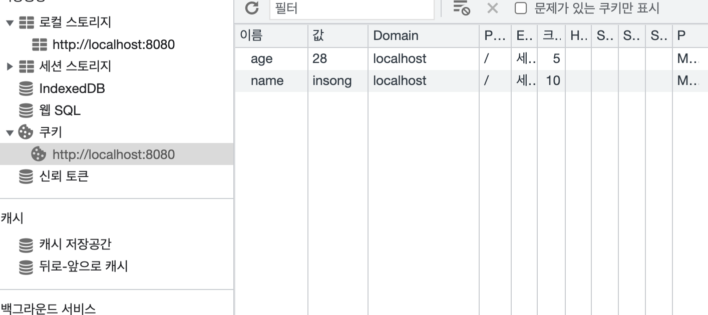
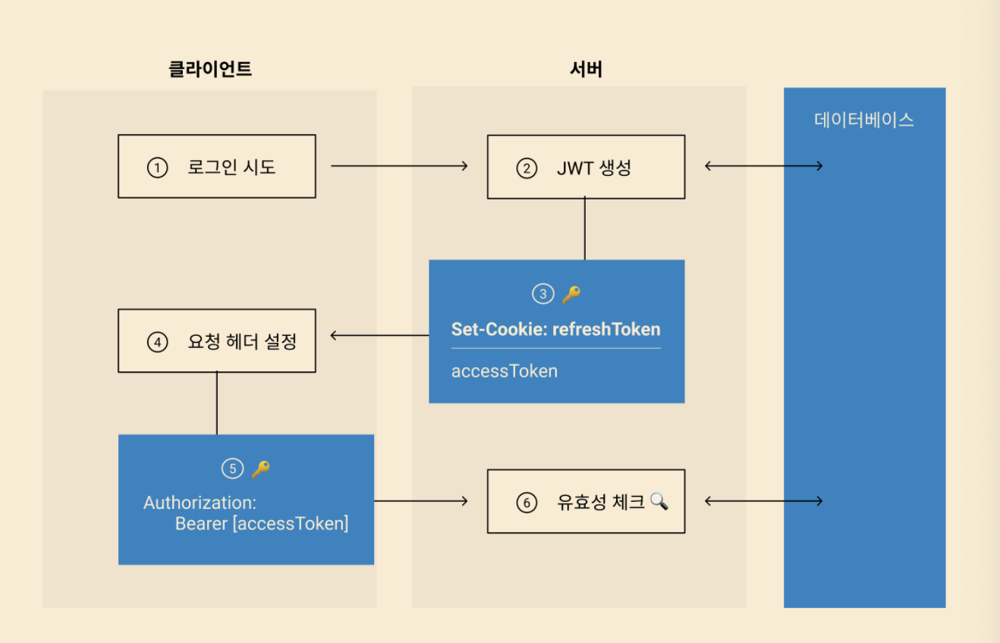

프론트 엔드 개발자로서 안전하게 로그인을 처리하는 것은 중요합니다. 이번 TAKEUS 서비스 QA 과정에서 발생했던 이슈도 로그인 부분을 잘 관리하지 못해서 발생했습니다. QA 과정에서 발생한 이슈 문제는 프론트 엔드에서의 에러 처리와 어세스 토큰을 적절하게 관리하지 못한 점에 원인이있었습니다. 에러 처리는 react-toast 를 활용해 처리할 예정이며, 어세스 토큰 관리 문제는 서버 개발자와 협업하여 해결하는 중입니다. 이번 포스트에서는 사용자 인증과 어떻게 안전하게 처리할 것인가에 대한 고민을 담으려고 합니다.

## HTTP 특성

HTTP는 인터넷 상에서 데이터를 주고 받기 위한 서버/클라이언트 모델을 따르는 프로토콜입니다. 클라이언트가 서버에게 요청을 보내면 서버는 응답을 보냄으로써, 데이터를 교환합니다. HTTP는 **비연결성** 및 **무상태성** 이라는 특징을 가지고 있습니다. HTTP는 요청에 대한 응답을 처리하게 되면 연결을 끊어 버립니다. 따라서 클라이언트에 대한 이전의 상태 정보 및 현재 통신의 상태가 남아있지 않습니다.

서버가 다수의 클라이언트와 연결을 계속 유지한다면, 이에 따른 자원 낭비가 심해집니다. 비연결성 및 무상태성의 특징을 가진다면 불필요한 자원 낭비를 줄일 수 있다는 장점이 있습니다. 그러나 서버는 클라이언트를 식별할 수 없다는 단점 또한 존재합니다. 로그인을 하더라도 다음 요청에서는 해당 클라이언트를 기억하지 못해, 또 로그인을 해야하는 문제가 발생합니다.

하지만 우리가 사용하고 있는 웹 사이트들의 경우, 한 번 로그인 하면 다시 로그인할 필요 없이 여러 페이지를 돌아다니며 다양한 기능들을 이용할 수 있습니다. 심지어는 브라우저를 껐다 켜도 로그인이 유지가 되기도 하지요. 이는 HTTP의 비연결성 및 무상태성 특징을 보완한 기술인 Cookie와 Session 덕분입니다.

## Cookie

**`쿠키`**란 **사용자가 웹 사이트를 탐색하는 동안 웹 서버에 의해 생성되어 사용자의 웹 브라우저에 저장되는 작은 데이터 블록**입니다. 서버는 클라이언트의 요청에 대한 응답을 작성할 때 응답 헤더의 `Set-Cookie` 에 담습니다. 이후 해당 클라이언트는 요청을 보낼 때마다, 매번 저장된 쿠키를 요청 헤더의 `Cookie` 에 담아 보냅니다. 따라서 서버는 쿠키에 담긴 정보를 기반으로 사용자를 식별할 수 있습니다.

다음은 `Express` 로 서버를 구축한 예시입니다. 클라이언트에서 `Button` 을 누르면 Post 요청을 보내고, 서버에서는 Cookie 를 저장해서 응답을 보낼 수 있습니다.

```jsx
app.post('/', (req, res) => {
  res.setHeader('Access-Control-Allow-Origin', 'http://localhost:8080')
  res.setHeader('Access-Control-Allow-Method', 'POST')
  res.cookie('name', 'insong')
  res.cookie('age', 28)
  res.json({ data: 'data' })
})
```

<div align="center">

</div>

응답을 확인해보면 Cookie 에 Set-Cookie 에 담겨있는 것을 확인할 수 있습니다. 하지만 애플리케이션 탭을 확인해보면 쿠키에는 아무것도 저장되어 있지 않습니다.

<div align="center">

</div>

저장하기 위해서는 두 가지 과정이 추가되어야합니다.

먼저 클라이언트 측에는 `Credentials include` 가 추가되어야합니다. 이를 명시해야 fetch 를 통해 쿠키를 보내거나 받을 수 있습니다. 이것 때문에 부스트캠프에서 거의 3시간을 보냈던 기억이 갑자기 납니다... 이 옵션은 쿠키를 보내기 위한 자격증명 옵션입니다.

```jsx
const response = await fetch('http://localhost:3000', {
  method: 'POST',
  credentials: 'include',
})
```

서버 측에는 다음을 명시해줘야합니다.

```jsx
res.setHeader('Access-Control-Allow-Credentials', true)
```

다음과 같이 잘 저장되는 것을 확인할 수 있습니다.

<div align="center">

</div>

하지만 Cookie 는 모두가 다 아는 문제를 지니고 있습니다. 먼저 보안에 취약합니다. 요청 시 저장된 쿠키의 값을 그대로 보내기 때문에 유출 및 조작의 위험이 있습니다. 또한 쿠키에는 용량 제한이 있어서 많은 정보를 담을 수 없습니다. 그리고 매번 요청시마다 헤더에 포함되기 때문에 쿠키의 사이즈가 커지면 네트워크의 부하가 심해집니다.

이렇게 JS 에서도 접근이 가능합니다.

```jsx
console.log(document.cookie) // name=insong; age=28
```

이는 cookie 를 set 할 때 서버에서 `httpOnly` 옵션을 부여함으로써 접근을 못하게 할 수 있습니다. 그래도 탈취가 되지 않을까요? 이 부분에 대해서는 추가적인 학습이 필요한 것 같습니다.

그리고 용량 제한이 얼마인지 궁금해서 한 번 찾아봤습니다. 쿠키는 4KB 의 용량 제한을 가집니다. 1KB 는 1024Byte 이고, 한 글자가 대략 2Byte 이므로 512글자 정도까지 쓸 수 있을 것 같습니다. 한 2000자까지는 쿠키에 값으로 작성할 수 있을 것 같습니다. 정확하지는 않아서 문서를 조금 더 확인해보겠습니다.

쿠키의 표준안인 RFC 2109 에 따르면 쿠키는 300개 까지 만들 수 있고, 최대의 크기는 4096Byte 이고, 하나의 호스트나 도메인에서 20개 정도를 만들 수 있다고 합니다.

## Session

일정 시간동안 같은 브라우저로 부터 들어오는 일련의 요구를 하나의 상태로 보고 그 상태를 유지하는 기술입니다. 사용자의 Request Header 쿠키에 사용자를 식별할 수 있는 세션 ID 를 집어넣어 이 ID 의 존재여부를 통해 사용자를 식별 및 상태 유지를 도와줍니다.

세션ID는 단순히 사용자를 식별할 수 있는 의미없는 문자만들로 만들어져 쿠키와 서버 저장소에 동시에저장되고, 클라이언트의 Request마다 세션ID를 서버측에 저장된 세션ID와 비교하여 식별됩니다.

다음과 같이 `express-session` 을 설치하고, 미들웨어로 추가합니다.

```jsx
const session = require('express-session')

app.use(
  session({
    secret: 'ksdjwv@!!ssz224455mml;/.v',
    cookie: {
      maxAge: 1000 * 30 * 1,
    },
  })
)
```

다음과 같이 쿠키에 저장된 SessionId 를 확인할 수 있습니다.

<div align="center">

</div>

서버에서도 sessionID 를 조회할 수 있고, 별도의 Store 로 저장하지 않는다면 메모리에 저장됩니다.

```jsx
console.log(req.sessionID);
// x5hb8M8nNlLRRWBSZsmDCrQxFEWQkZ7_

console.log(req.session);
// Session
Session {
  cookie: {
    path: '/',
    _expires: 2022-01-17T10:15:53.037Z,
    originalMaxAge: 30000,
    httpOnly: true
  }
}
```

세션은 요청이 외부에 노출되더라도 세션 ID 자제는 유의미한 정보를 담고 있지 않습니다. 하지만 이를 해커가 탈취하여 사용자인것처럼 요청을 보내는 CSRF 공격의 위험이 있습니다. 그리고 서버에서 해당 사용자의 정보를 저장해야하기 때문에 별도의 메모리가 필요합니다.

## JWT 는 왜 사용하는가?

사용자를 인증하고 정보를 공유하는 안전한 방법을 제공합니다. 과연 **어떻게 안전하게 로그인을 보장할 수 있을까요?** 쿠키와 세션을 활용하는 방식은 단점이 존재합니다. 쿠키는 보안의 위험이, 세션은 메모리 부하의 측면에서 문제가 있었습니다.

`세션 ID` 를 이용하는 방식은 로그인 시 특정 유저의 정보를 담은 세션을 생성하고 이 ID 를 클라이언트에게 보내줍니다. 클라이언트는 이를 저장해두고, 인증이 필요한 데이터를 요청할 때 헤더에 세션 id 를 포함해서 요청을 보냅니다. 서버는 이 `세션 ID` 가 유효한지 확인하고 클라이언트가 요청한 데이터를 전송합니다.

`세션 쿠키`는 세션 식별 정보를 쿠키로 저장하는 정책을 사용할 경우, 클라이언트의 쿠키로 저장된 세션 데이터 전체를 의미하고, `세션 ID` 는 그 쿠키에 저장되어 있는 값을 의미합니다. 세션 ID 의 고유 의미는 서버에서 로그인 된 사용자의 세션을 식별하는 값을 의미합니다.

## JWT 란 무엇인가?

JSON 객체를 사용하여 가볍고 자가수용적인 (self-contained) 방식으로 정보를 안전성 있게 전달해주기 위한 토큰입니다. 두 Party 간에 보안 정보를 공유하는데 사용하는 개방형 표준입니다.

## JWT 는 어떻게 동작하는가?

<div align="center">

</div>

**Header, Payload, Signature**가 JWT의 구성요소이다.이들이 JSON형태로 담겨있어서 Json Web Token입니다.이들을 부호화하고 암호화시켜 만들어낸 것이 오른쪽 형태입니다

- **Header**에는 `어떤 알고리즘으로 암호화` 할 것인지, 토큰은 어떤 타입을 쓸 것인지와 같은 `토큰 관련 정보`가 담깁니다.
- **Payload**에는 `사용자 인증 관련 정보`가 담깁니다. 여기에 담는 **정보의 한 ‘조각’ 을 클레임(Claim)** 이라고 부르고, 이는 Json(Key/Value) 형태의 한 쌍으로 이뤄져있습니다. 토큰에는 여러개의 클레임을 넣을 수 있고 3가지 종류의 클레임을 넣을 수 있습니다. 등록된 클레임, 공개 클레임, 비공개 클레임이 있습니다.
- Signature 는 토큰을 인코딩하거나 유효성 검증을 할 때 사용하는 고유한 암호화 코드입니다. `서명(Signature)`은 위에서 만든 헤더(Header)와 페이로드(Payload)의 값을 각각 BASE64로 인코딩하고, 인코딩한 값을 비밀 키를 이용해 헤더(Header)에서 정의한 알고리즘으로 해싱을 하고, 이 값을 다시 BASE64로 인코딩하여 생성합니다.

이후의 추가적인 내용은 너무 내용이 많아서 생략하겠습니다.

담기는 정보 중 `accessToken` 과 `refreshToken` 이 이후 유저 인증에 사용되는데 이 정보를 클라이언트에 저장해줍니다. 이 `accessToken` 은 일정 시간이 지나면 만료되며, 이를 재발급받기 위해서는 `refreshToken` 을 이용해야합니다.

<div align="center">

</div>

하지만 `AccessToken`이 탈취되는 순간부터 만료되는 순간까지는 보안적인 위험이 여전히 존재합니다. 이를 어떻게 하면 안전하게 처리할 수 있을까요? 먼저 클라이언트에서 데이터를 저장하기 위해 사용하는 저장소에 대해서 알아봅시다. 크게 3가지로 나눌 수 있습니다.

1. `localStorage`
2. 쿠키 저장 방식
3. `secure` `httpOnly 쿠키`

각각의 방식에 대해서 알아보겠습니다.

### 1. `localStorage`

- localStorage 안에 세션 id, refreshToken 또는 accessToken을 저장해두면 XSS 취약점을 통해 그 안에 담긴 값을 불러오거나, 불러온 값을 이용해 API 콜을 위조할 수 있습니다.

### 2. `쿠키 저장 방식`

브라우저에 쿠키로 저장되는데, 클라이언트가 HTTP 요청을 보낼 때마다 자동으로 쿠키가 서버에 전송됩니다. Javascript 내 **글로벌 변수**로 **읽기 / 쓰기 접근이 가능합니다.**

- 쿠키 저장 방식 역시 안에 세션 id, refreshToken, accessToken을 저장해두면 XSS 취약점이 있을 때 담긴 값들을 불러오거나, API 콜을 보내면 쿠키에 담긴 값들이 함께 전송되어 로그인한 척 공격을 수행할 수 있습니다.
- 쿠키에 세션 id나 accessToken을 저장해 인증에 이용하는 구조에 CSRF 취약점이 있다면 인증 정보가 쿠키에 담겨 서버로 보내집니다. 공격자는 유저 권한으로 정보를 가져오거나 액션을 수행할 수 있습니다.

### 3. `secure` `httpOnly` 쿠키 저장 방식

- httpOnly 쿠키 방식으로 저장된 정보는 XSS 취약점 공격으로 담긴 값을 불러올 수 없습니다.
- httpOnly 쿠키 역시 refreshToken만 저장하고 accessToken을 받아와 인증에 이용하는 구조로 CSRF 공격 방어가 가능합니다.
- 하지만 XSS 취약점을 노려 API 콜을 요청하면 httpOnly 쿠키에 담긴 값들도 함께 보내져 유저인척 정보를 빼올 수 있습니다.

따라서 어떤 저장 방식을 선택하더라도 보안 이슈는 존재합니다. 따라서 클라이언트와 서버에서는 추가적인 XSS 방어 처리가 필수적입니다. 이 방어 처리에 대해서는 `Sanitizer API` 에 대해서 찾아보시면 좋을 것 같습니다.

그래서 어떻게 로그인을 처리해야 안전한 것일까요?

- JWT 로 유저 인증해야합니다. 토큰이 탈취되어도 만료기한이 있기 때문입니다.
- `refreshToken` 을 `secure httpOnly` 쿠키로 사용하고, `accessToken` 은 `JSON payload` 로 받아와서 웹 어플리케이션 내 로컬 변수로 이용해야합니다.
- XSS 취약점을 통해 API 콜을 보낼 때 무방비하기 때문에 XSS 자체를 막기 위한 추가적인 대책이 필요합니다.

<div align="center">

</div>

## React 에 적용하기

위에서 이야기한 3가지 케이스에 대응하기 위해 API가 2개 필요합니다.

1. `POST /login`: 이메일, 비밀번호를 보내면 `refreshToken`을 헤더의 Cookie 로 설정하고 `accessToken` 를 payload 로 리턴합니다.
2. `POST /silent-refresh`: 쿠키에 담긴 `refreshToken`이 자동으로 보내지면 위와 동일한 로직으로 새로운 `refreshToken`과 `accessToken`을 리턴합니다.

클라이언트에서는 받아온 AccessToken 을 로컬 변수로 저장하고, 요청시 토큰을 헤더에 AccessToken 을 포함시켜서 전송합니다.

1. JWT Token 이 만료되기 1분 전에 onSilentRefresh 함수를 수행합니다.
2. 페이지가 리로드 된경우에 onSilentRefresh 함수를 호출합니다.

```jsx
const JWT_EXPIRY_TIME = 24 * 3600 * 1000 // 만료 시간 (24시간 밀리 초로 표현)

onLogin = (email, password) => {
  const data = {
    email,
    password,
  }
  axios
    .post('/login', data)
    .then(onLoginSuccess)
    .catch(error => {
      // ... 에러 처리
    })
}

onSilentRefresh = () => {
  axios
    .post('/silent-refresh', data)
    .then(onLoginSuccess)
    .catch(error => {
      // ... 로그인 실패 처리
    })
}

onLoginSuccess = response => {
  const { accessToken } = response.data

  // accessToken 설정
  axios.defaults.headers.common['Authorization'] = `Bearer ${accessToken}`

  // accessToken 만료하기 1분 전에 로그인 연장
  setTimeout(onSilentRefresh, JWT_EXPIRRY_TIME - 60000)
}
```

### 마무리

로그인을 안전하게 처리하기 위해 고민하고 세션, 쿠키, JWT Token 에 대해서 살펴봤습니다.
관련된 개념이 처음에는 많이 생소했었는데 서버를 생성하고 구현하면서 이전보다는 잘 이해할 수 있었던 것 같습니다.
그래도 아직 많이 부족하다는 생각이 들었습니다. 좀 더 깊게 공부해봐야겠습니다.
