# 들어가며

> 인터넷 자체가 협업을 위해 만들어진 것입니다. 서로 멀리 떨어진 사람들의 머릿속에 있는 생각의 조각을 이어 하나의 해답을 찾을 수 있도록 하는 것이 내가 www 를 만든 목표였습니다. - 팀 버너스리

웹을 구성하는 중요 요소인 HTML 은 다양한 플랫폼과 장치에 독립적인 정보교환 수단을 제공하기 위해 탄생했습니다. 쉽게 말하면 **웹은 원래부터 사용자의 환경이나 사용하는 기기, 운영체제에 가능한 한 영향을 받지 않고 웹이 제공하는 정보를 사용자에게 전달하고자 하는 목적**에서 만들어진 정보 전달 체계입니다.

최초의 탄생 목적이 이러했기 때문에 웹은 단기간에, 다양한 환경에서, 다양한 사람들이 정보를 공유하는 공간이 될 수 있었습니다. 이러한 관점에서 본다면, 웹 접근성은 새롭게 등장한 개념이 아니라 웹 자체가 당연히 가져야 할 개념이라고 할 수 있습니다.

# 웹 접근성

모든 사용자가 **신체적·환경적 조건**에 관계없이 웹에 접근하여 이용할 수 있도록 보장하는 것입니다.

**신체적 조건**이란 일반 사용자는 물론, 장애를 가진 사람, 고령자 등을 의미합니다. **환경적 조건**이란 다양한 기기, OS, 웹 브라우저 또는 저사양 및 저속회선 사용자나 이미지, 동영상 등을 볼 수 없는 환경 등을 의미합니다.

<div align="center">
  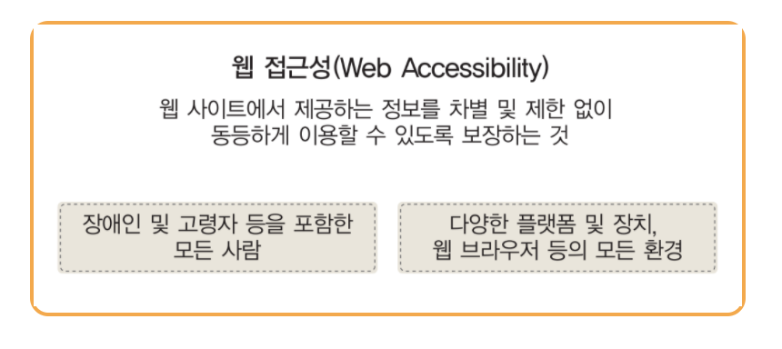
</div>

그럼 이제 웹 접근성을 어떻게 준수해야하는지에 대해서 알아봅시다.

## 웹콘텐츠 접근성 지침(WCAG)

웹 표준화 관련 국제 기구인 W3C(World Wide Web Consortium)에서는 1990년대 중반 이후 폭발적으로 성장한 웹 서비스에서 장애인의 접근성에 관련된 문제가 발생했습니다.

1997년에 W3C는 웹 접근성 이니셔티브(WAI; Web Accessibility Initiative)라는 산하 단체를 설립하여 이 문제를 전문적으로 연구하기 시작했습니다. WAI는 웹 접근성을 위해 다양한 활동을 펼치고 있는데, 그 중의 하나가 웹 접근성을 위한 지침을 마련하는 것입니다.

WAI의 웹 콘텐츠 접근성 지침 4가지는 다음과 같습니다.

<div align="center">
  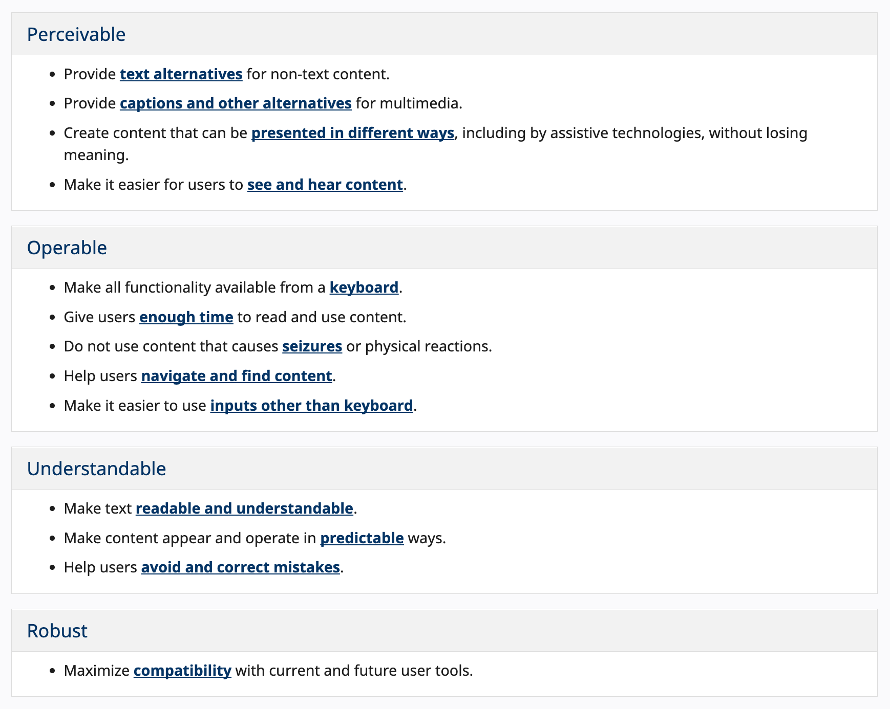
</div>

4가지 원칙과 각 원칙을 준수하기 위한 13개 지침으로 구성되어있습니다. WAI 에서 정한 웹 콘텐츠 접근성 지침을 바탕으로 한국에서는 한국형 웹 콘텐츠 접근성 지침 2.1 을 발표했으며, 이는 24개의 검사항목으로 구성되어 있습니다. (2015.3.31 기준 KWCAG 2.1개정)

4가지 원칙과 24개의 검사 항목을 기준으로 하나씩 살펴보겠습니다. 개발자보다는 다른 직군에서 신경써야할 부분도 있지만 처음 접하시는 분들을 위해 전부 가져와봤습니다. 개발자가 조금 더 신경쓸 항목에 대해서는 음영처리를 했습니다.

### 1. **인지성(Perceivable)**

모든 콘텐츠는 사용자가 인식할 수 있어야 합니다.

- **(적절한 대체 텍스트 제공) 텍스트 아닌 콘텐츠는 그 의미나 용도를 이해할 수 있도록 대체 텍스트를 제공해야 합니다.**

``, `<input type=”image”>` 등 이미지 요소에 정확한 alt 속성을 기입해야합니다.

꾸밈용으로 제공된 불릿 이미지의 경우 alt 속성을 빈 값으로 제공해야한다.

<div align="center">
  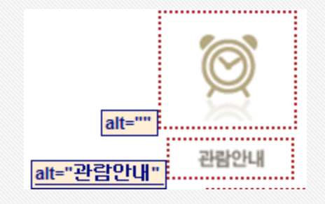
</div>

- 이미지에 내용이 많은 경우 `alt` 속성 값은 이미지의 제목 정도로 제공하고, 자세한 내용은 숨김 텍스트로 제공해야한다.

<div align="center">
  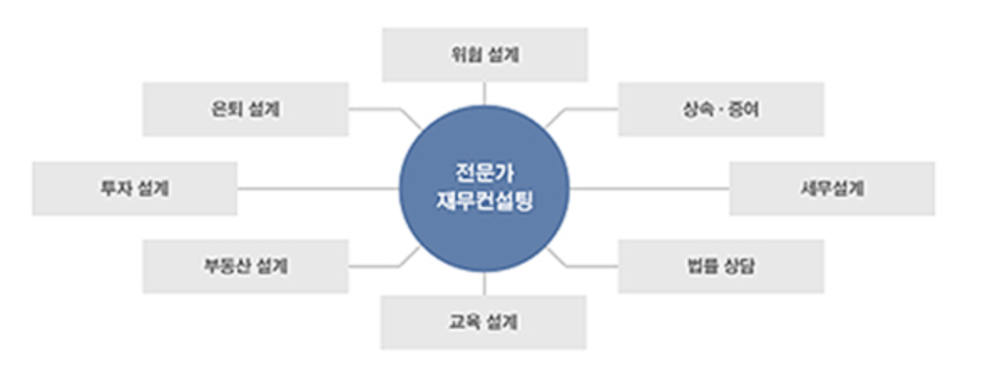
</div>

```jsx
// html

<div class="hidden">
<h1>전문가 재무컨설팅</h1>
	<ul>
		<li>위험 설계</li>
		<li>상속/증여</li>
		<li>세무설계</li>
		<li>법률 상담</li>
		<li>교육 설계</li>
		<li>부동산 설계</li>
		<li>투자 설계</li>
		<li>은퇴 설계</li>
	</ul>
</div>

// css
.hidden{display:block; height: 0; width: 0; font-size: 0; line-height: 0; margin: 0; padding: 0; overflow:hidden;}
```

여기서 주의할 내용은 숨김텍스트 제공 시 `visibility: hidden` 과 `display: none` 은 스크린리더기 마다 인식 여부가 다르므로, 사용하지 않아야한다는 것입니다. 위와 같이 `height : 0; width: 0` 속성값을 부여해야합니다.

- **(자동 재생 금지) 자동으로 소리가 재생되지 않아야 합니다.**
- **(콘텐츠 간의 구분) 이웃한 콘텐츠는 구별될 수 있어야 합니다.**
- **(색에 무관한 콘텐츠 인식) 콘텐츠는 색에 관계없이 인식될 수 있어야 합니다.**

<div align="center">
  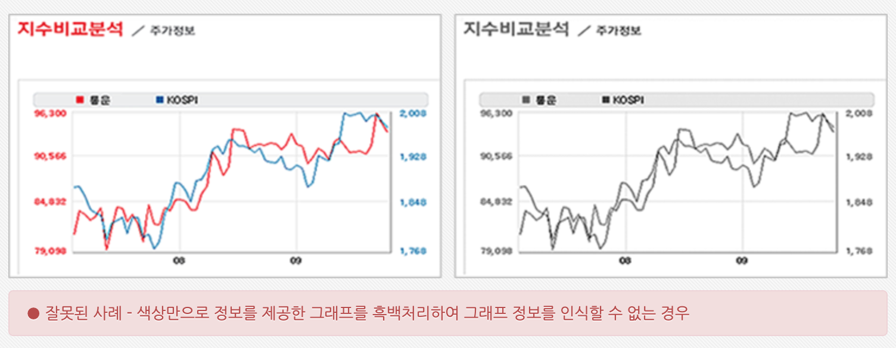
</div>

<div align="center">
  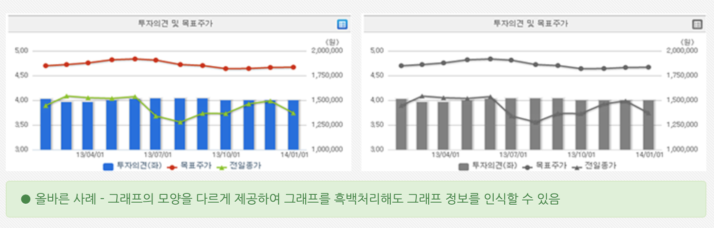
</div>

- **(명확한 지시사항 제공) 지시사항은 모양, 크기, 위치, 방향, 색, 소리 등에 관계없이 인식될 수 있어야 합니다.**

<div align="center">
  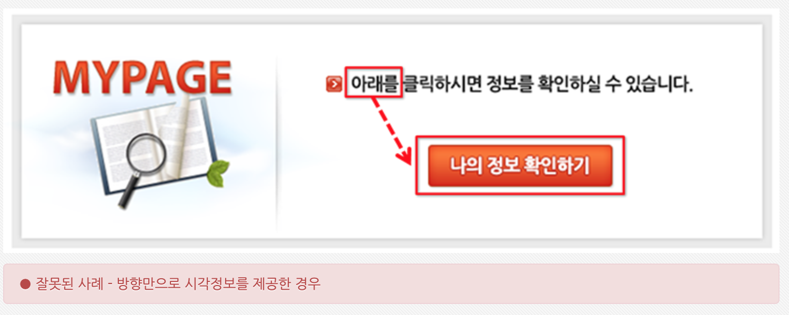
</div>

<div align="center">
  
</div>

- (텍스트 콘텐츠의 명도 대비) 텍스트 콘텐츠와 배경 간의 명도 대비는 4.5대 1 이상이어야 합니다.
  <div align="center">
    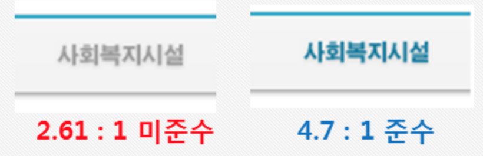
  </div>

### 2. **운용성(Operable)**

사용자 인터페이스 구성요소는 조작 가능하고 내비게이션 할 수 있어야 합니다.

- **(키보드 사용 보장) 모든 기능은 키보드만으로도 사용할 수 있어야 한다. (PC웹)**
  - 모달의 경우 ESC 를 눌렀을 때 닫히는 기능을 제공하는 것도 운용성을 준수한 개발입니다. 용호님이 말씀해주셨던 기억이 나네요.
- **(누르기 동작 지원) 터치(touch) 기반 모바일 기기의 모든 컨트롤은 누르기 동작으로 제어할 수 있어야 한다. (모바일웹)**
- **(초점 이동) 키보드에 의한 초점은 논리적으로 이동해야 하며 시각적으로 구별할 수 있어야 한다.**

<div align="center">
  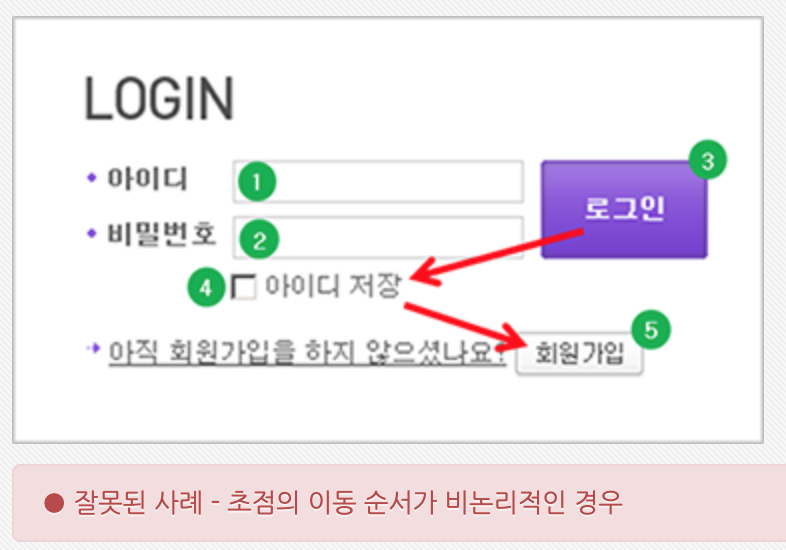
</div>

<div align="center">
  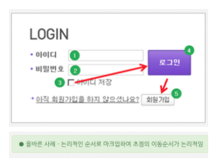
</div>

- **(조작 가능) 사용자 입력 및 컨트롤은 조작 가능하도록 제공되어야 한다.**
- **(응답시간 조절) 시간제한이 있는 콘텐츠는 응답시간을 조절할 수 있어야 한다.**
- **(정지 기능 제공) 자동으로 변경되는 콘텐츠는 움직임을 제어할 수 있어야 한다.**

<div align="center">
  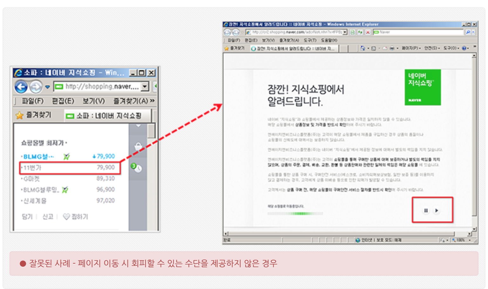
</div>

<div align="center">
  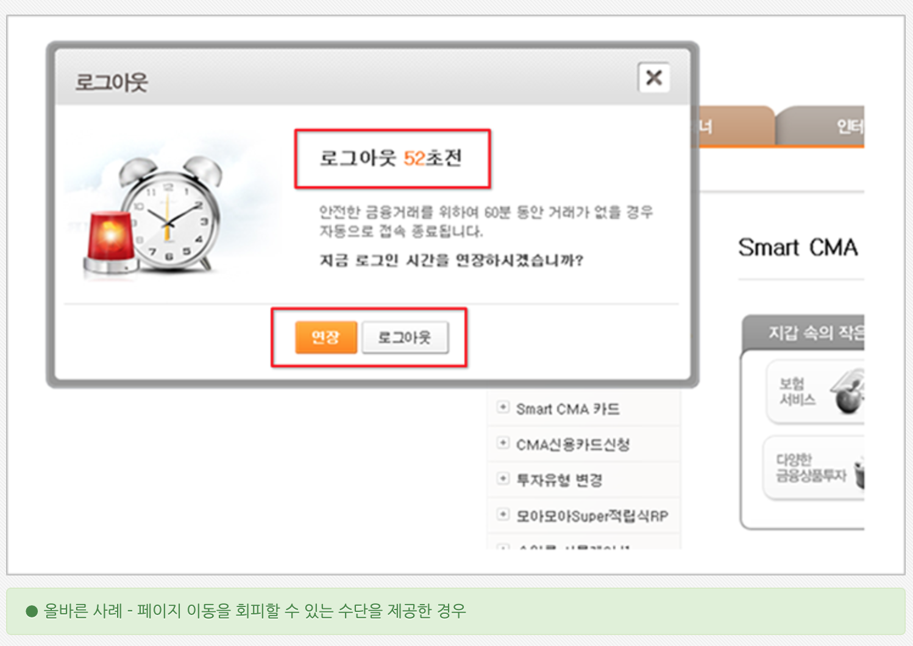
</div>

- **(제목 제공) 페이지, 프레임, 콘텐츠 블록에는 적절한 제목을 제공해야 한다.**
  iframe 에 올바른 제목을 제공해야합니다.
- **(적절한 링크 텍스트) 링크 텍스트는 용도나 목적을 이해할 수 있도록 제공해야 한다.**
- **(깜빡임과 번쩍임 사용 제한) 초당 3~50회 주기로 깜빡이거나 번쩍이는 콘텐츠를 제공하지 않아야 한다.**
- (반복 영역 건너뛰기) 콘텐츠의 반복되는 영역은 건너뛸 수 있어야 한다.

### 3. **이해성(Understandable)**

콘텐츠는 이해할 수 있어야 합니다.

- **(기본 언어 표시) 주로 사용하는 언어를 명시해야 한다.**
  ```html
  <!DOCTYPE html> <html lang="ko“ > //...
  ```
- **(레이블 제공) 사용자 입력에는 대응하는 레이블을 제공해야 한다.**
  `<input>`, `<textarea>`, `<select>` 요소에 1:1 대응하는 `label` 요소를 명시해야합니다. 다음 예시는
  `<label>` 의 for 와 `<input>` 의 id 를 통해 웹 접근성을 준수한 예시입니다.
  ```html
  <label for="name">Name (4 to 8 characters):</label>
  <input
    type="text"
    id="name"
    name="name"
    required
    minlength="4"
    maxlength="8"
    size="10"
  />
  ```
  만약, 디자인 상 label 을 수용할 수 없다면 `title` 요소를 명시합니다.
- **(오류 정정) 입력 오류를 정정할 수 있는 방법을 제공해야 한다.**
  입력 오류 발생 시 요루 원인 및 내용을 적절한 설명 텍스트로 알려줘야합니다. 오류 정보 확인 시, 정정할 수 있는 수단을 제공해야하고, 해당 입력 서식으로 초점을 이동시킬 수 있어야합니다. 또한 입력 내용이 모두 사라져서는 안됩니다.

<div align="center">
  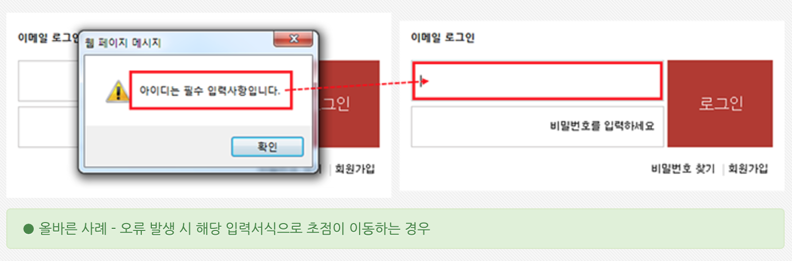
</div>

- (콘텐츠의 선형화) 콘텐츠는 논리적인 순서로 제공해야 한다.
- (사용자 요구에 따른 실행) 사용자가 의도하지 않은 기능 (새 창, 초점 변화 등)은 실행되지 않아야 한다.
- (표의 구성) 표는 이해하기 쉽게 구성해야 한다.

### 4. **견고성(Robust)**

웹 콘텐츠는 미래의 기술로도 접근할 수 있도록 견고하게 만들어야 합니다.

- **(마크업 오류 방지) 마크업 언어의 요소는 열고 닫음, 중첩 관계 및 속성 선언에 오류가 없어야 한다.**
- (웹 애플리케이션 접근성 준수) 콘텐츠에 포함된 웹 애플리케이션은 접근성이 있어야 한다.

굉장히 많은 항목들이 있습니다. 우리는 어떻게 웹 접근성을 준수했는지 확인할 수 있을까요? 정말 간단하게 운용성을 확인하는 방법으로는 주소창부터 **Tab(정방향), Shift + Tab(역방향), Enter 키**와 같은 키보드 동작으로 문서의 처음부터 끝까지 모든 기능을 이용 및 사용할 수 있는지 점검할 수 있습니다. 이를 통해 “키보드 만으로 모든 기능이 사용이 가능한지?”, “초점의 이동순서가 논리적인지?” 를 판단할 수 있습니다.

접근성을 검사해주는 사이트나 도구를 활용할 수 도 있습니다. [해당 블로그](https://eunyoe.tistory.com/76) 는 관련된 사이트를 정리해놓은 블로그입니다. 한 번 살펴보셔도 좋을 것 같습니다.

### 웹 접근성 준수 시 기대효과

웹 접근성 준수를 통한 기대효과에는 크게 다음 5가지가 있습니다.

- 장애인, 고령자 등을 포함한 사용자층 확대
- 규정과 법적 요구 사항에 대한 준수
- 다양한 환경, 새로운 기기에서의 이용
- 개발 및 운용의 효율성 제고
- 사회 공헌 및 복지 기업으로서의 기업 이미지 향상

# 웹 표준

웹 표준은 웹 접근성을 향상시킬 수 있는 다양한 방법론의 중심에 있습니다. 웹 표준이란 웹에서 표준적으로 사용되는 기술이나 규칙을 의미합니다. 웹에서의 표준은 W3C의 토론을 통해 나온 권고안을 말하며, 권고안 이외 단계 수준의 스펙은 비표준이거나 독자확장 요소를 의미하기 때문에 구분하여 사용해야합니다.

<div align="center">
  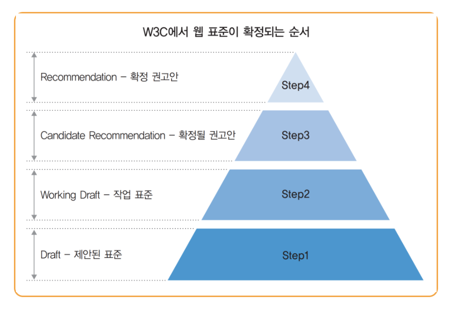
</div>

웹 표준 관련 기술은 크게 구조, 표현, 동작으로 구분됩니다.

<div align="center">
  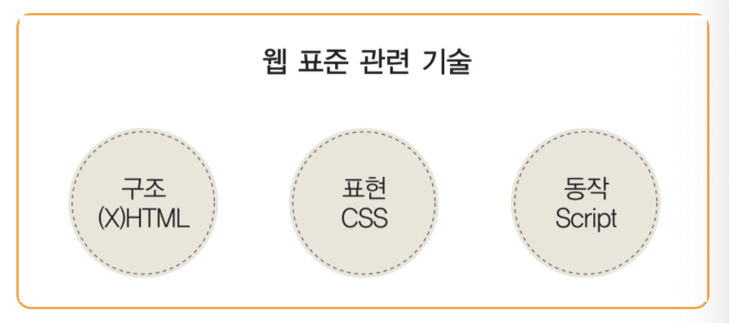
</div>

웹 표준을 준수하기 위해서는 웹의 구조, 표현, 동작을 위한 언어를 사용 방법에 맞게 준수하는 것이 중요합니다. 어떻게 해당 언어들을 사용할 것인지에 대한 내용은 스터디에 대한 주제로 다루기에는 방대하기 때문에 생략하겠습니다. 대신 W3C 의 권고안으로 지정된 WAI-ARIA 에 대해서 간략히 소개하고 글을 마무리하겠습니다.

### WAI-ARIA

W3C(World Wide Web Consortium, 이하 W3C)에서는 웹 콘텐츠 및 웹 애플리케이션의 접근성과상호 운용성을 개선하기 위해 기술 명세를 발표했는데 이 명세가 바로 WAI-ARIA(Web Accessibility Initiative - Web Accessible Rich Internet Applications, 이하 WAI-ARIA) 입니다.

WAI-ARIA는 스크린리더 및 보조기기 등에서 접근성 및 상호 운용성을 향상시키기 위한 목적으로 탄생했으며 웹 애플리케이션에 역할(Role), 속성(Property), 상태(State) 정보를 추가하여 이를 개선 할 수 있도록 제공하고 있습니다.

2014년 3월 20일 WAI-ARIA는 W3C 권고안으로 지정되었으며, WAI-ARIA 명세의 일부는 HTML5 명세와 통합되었습니다.

[예제로 살펴보는 WAI-ARIA](https://www.wah.or.kr:444/board/boardView.asp?page=1&brd_sn=5&brd_idx=1019) 를 통해서 자세한 내용을 확인하실 수 있습니다. 200p 넘는 PDF 문서인데, 사례집에 해당하는 기능을 개발할 때 한 번씩 참고해서 보면 좋을 것 같습니다.

<div align="center">
  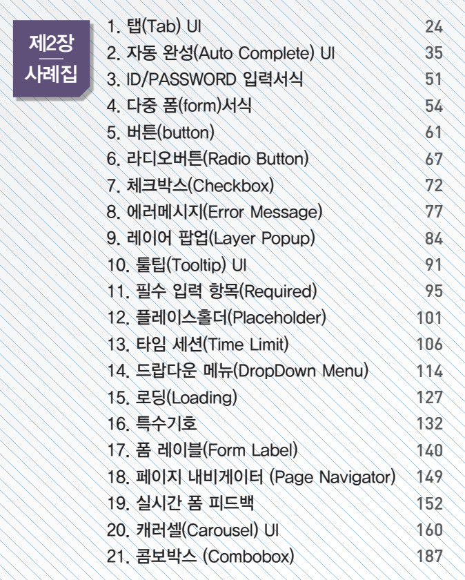
</div>
