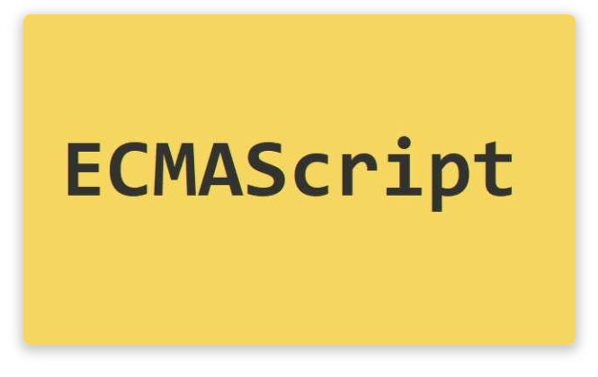
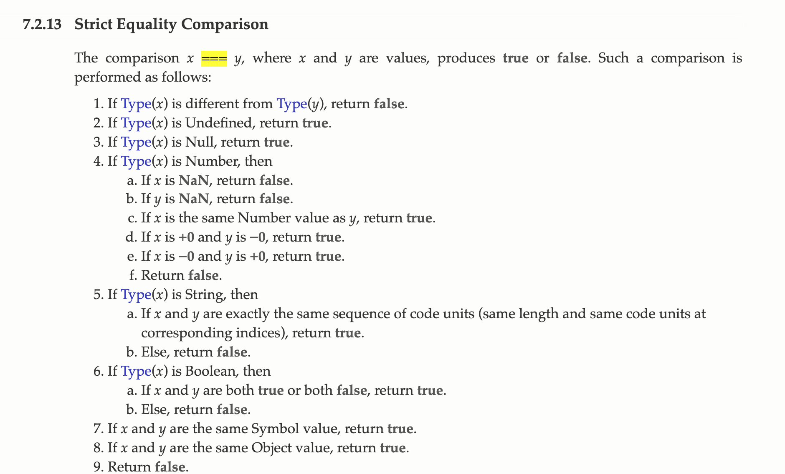
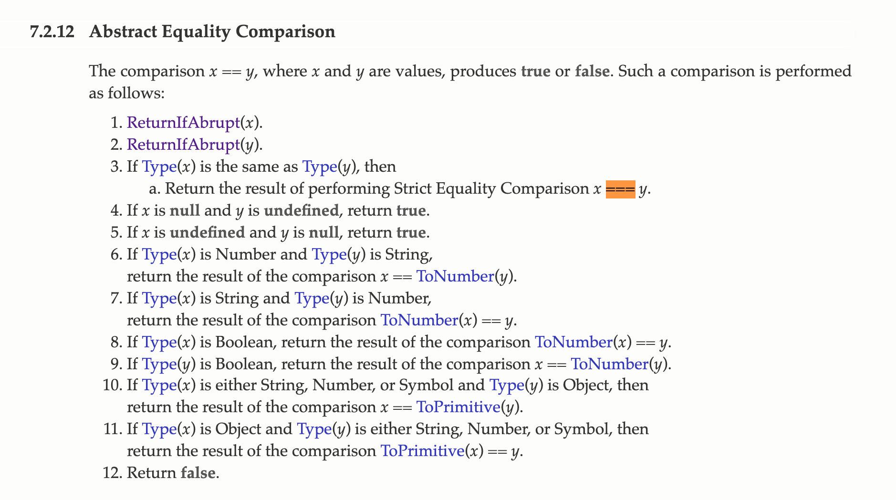

<div align="center">
  
</div>
평소에 사용하던 비교 연산자의 차이를 ECMAScript문서를 보면서 이해해보자.

## concepts

비교 연산자는 피연산자를 서로 비교하고, 비교 결과가 참인지에 따라 논리 값을 반환한다. 피연산자로는 숫자, 무낮열, 논리형, 객체 값을 사용할 수 있다. 문자열은 **Unicode** 값을 사용한 표준 사전식 순서를 기반으로 비교한다. 만약 두 피연산자가 서로 다른 타입일 경우 JavaScript가 피연산자를 비교하기에 적합한 타입으로 변환한다.

<br/>

**Notes**

Unicode란 전 세계의 모든 문자를 컴퓨터에서 일관되게 표현할 수 있도록 고안된 코드 조합이다. 유니코드는 전 세계 거의 모든 문자를 2bytes 숫자로 1:1 매핑 시키는 방식을 의미한다. 그리고 이 유니코드를 표현하는 여러가지 인코딩 방식들이 존재한다. 대표적으로 ASCII, ANSI, UTF-8, UTF-16이 있다.

타입으로 변환한다는 내용을 다루기 위해서 JS 코드를 작성할 때 발생하는 타입 변환 2가지에 대해서 먼저 살펴보자. 우리는 대부분 비교 연산자에서는 해당 값의 형 변환을 직접 해주지 않고 비교하기 때문에 이 때는 암묵적 타입 변환이 발생한다고 생각하고 이해하면 좋을 것 같다.

## 암묵적 타입 변환

자바스크립트 엔진은 표현식을 평가할 때 문맥, 즉 컨텍스트(Context)에 고려하여 암묵적 타입 변환을 실행한다. 프로토타입 언어인 JS는 해당 코드가 실행되는 문맥이 강조된다. 따라서 암묵적 타입 변환도 동일하게 컨텍스트를 고려해 타입 변환이 수행된다.

1. 문자열 타입으로 변환

```jsx
1 + '2' // "12"
```

위 예제의 `+` 연산자는 피연산자 중 하나 이상이 문자열이므로 문자열 연결 연산자로 동작한다. 문자열 연결 연산자의 역할은 문자열 값을 만드는 것이다. 따라서 문자열 연결 연산자의 피연산자는 문맥, 즉 컨텍스트 상 문자열 타입이여야 한다.

자바스크립트 엔진은 문자열 연결 연산자 표현식을 평가하기 위해 문자열 연결 연산자의 피연산자 중에서 문자열 타입이 아닌 피연산자를 문자열 타입으로 암묵적 타입 변환한다.

2. 숫자 타입으로 변환

```jsx
1 - '1' // 0
1 * '10' // 10
1 / 'one' // NaN
```

위에 사용된 연산자들은 모두 산술 연산자다. 산술 연산자의 역할은 숫자 값을 만드는 것이다. 따라서 산술 연산자의 피연산자는 문맥, 즉 컨텍스트 상 숫자 타입이여야 한다. 자바스크립트 엔진은 산술 연산자 표현식을 평가하기 위해 산술 연산자의 피연산자 중에서 숫자 타입이 아닌 피연산자를 숫자 타입으로 암묵적 타입 변환한다. 이때 피연산자를 숫자 타입으로 변환할 수 없는 경우는 산술 연산을 수행할 수 없으므로 NaN을 반환한다.

3. 불리언 타입으로 변환

if 문이나 for 문과 같은 제어문의 조건식은 불리언 값, 즉 논리적 참, 거짓을 반환해야 하는 표현식이다. JS 엔진은 제어문의 조건식의 평과 결과를 불리언 타입으로 암묵적 타입 변환한다.

```jsx
if ('') console.log('1')
if (true) console.log('2')
if (0) console.log('3')
if ('str') console.log('4')
if (null) console.log('5')

// 2 4
```

이 때 JS 엔진은 불리언 타입이 아닌 값을 Truthy 값 또는 Falsy 값으로 구분한다. 즉, Truthy 값은 true로 Falsy 값은 false로 변환된다.아래의 값들은 제어문의 조건식과 같이 불리언 값으로 평가되어야할 컨텍스트에서 false로 평가되는 Falsy 값이다.

- false
- undefined
- null
- 0, -0
- NaN
- ’’ (빈문자열)

<br/>

**Notes**

타입 강제 변환(Type coercion)은 JS의 엔진에 의해 암묵적으로 타입이 자동 변환되는 과정이다. 암묵적 타입 변환(Implicit coercion)이라고도 한다. 타입 캐스팅(Type Casting)은 어떤 값을 다른 타입의 값으로 바꾸는 과정이 명시적이다. 명시적 타입 변환(Explicit coercion)이라고도 한다.

## 명시적 타입 변환

명시적 타입 변환은 개발자의 의도에 의해 타입을 변경하는 것이다. 다음과 같은 방법을 사용할 수 있다.

- 래퍼 객체를 생성하기 위해 사용하는 래퍼 객체 생성자 함수를 new 연산자 없이 호출하는 방법

JS 엔진이 암묵적으로 연관된 객체인 래퍼객체를 임시로 생성하여 생성된 객체로 프로퍼티나 메서드에 접근한 후, 다시 원시값으로 되돌린다.

- 자바스크립트에서 제공하는 빌트인 메소드를 사용하는 방법

parseInt, parseFloat 등이 있다.

- 암묵적 타입 변환

<br/>

**Notes**

JS객체는 크게 3가지로 분류될 수 있다. 먼저, 표준 빌트인 객체이다. 이는 ECMAScript 사양에 정의된 객체이다. 다음은 호스트 객체이다. 이는 자바스크립트 실행 환경에서 추가로 제공하는 객체이다. 마지막은 사용자가 직접 정의한 객체이다.

## == 과 ===

`==` 은 동등 연산자이며 동등함 비교시 강제 변환을 허용한다. 해당 동등 연산자를 활용해 피연산자를 비교할 때 느슨한 동등 비교를 한다고 말한다. `===` 은 동등함 비교시 강제 변환을 허용하지 않는다. 해당 일치 연산자를 활용해 비교할 때 엄격한 동등 비교를 한다고 말한다.

이제 엄격한 동등 비교에 대한 내용이 명시된 ECMAScript 명세를 살펴보자.

### 7.2.13 엄격한 동등 비교

<div align="center">
  
</div>

<br/>
엄격한 동등 비교를 수행하는 === 연산자를 사용하고 피연산자는 x와 y이다. 하나씩 살펴보자.

- x와 y의 타입이 다르다면 false를 return한다.
- x와 y가 모두 Undefined와 Null이라면 true를 return한다.
- x와 y가 모두 Number이고 두 피연산자 모두 NaN이 아니며, 숫자 값이 같다면 true를 return한다.
- x와 y가 모두 String이고 **Unicode** 값을 사용한 표준 사전식 순서를 기반으로 비교했을 때 같다면 true를 return한다.
- x와 y가 모두 Object이거나 Symbol이라면 변수에 할당된 메모리 주소가 같다면 true를 return한다.
- true를 return하는 조합에 해당되지 않는다면 false를 return한다.

생각보다 복잡하지 않다. 이제 느슨한 동등 비교를 수행하는 == 연산자를 살펴보자.

### 7.2.12 느슨한 동등 비교

<div align="center">
  
</div>

<br/>
느슨한 동등 비교를 수행하는 == 연산자를 사용하고 피연산자는 x와 y이다. 하나씩 살펴보자.

- 타입이 같다면 === 연산자를 사용하는 비교 알고리즘을 사용한다.
- 두 피연산자가 각각 null 이고 undefined이면 true를 return한다.
- 문자와 숫자를 비교한다면 문자를 ToNumber를 통해 숫자로 강제 변환한 후 둘을 비교한다.
- 하나의 피연산자가 Boolean이라면 이를 ToNumber를 통해 강제 변환하고 둘을 비교한다.
- 원시 자료형인 String, Number, Symbol 중 하나의 피연산자와 참조 자료형인 객체인 피연산자를 비교한다면 객체를 ToPrimitive를 통해 원시 자료형으로 변환한 뒤 비교한다.
- true를 return하는 조합에 해당되지 않는다면 false를 return한다.

## Recap

먼저, 타입 강제 변환과 타입 캐스팅에 대해서 살펴봤다.

- 타입 강제 변환
  - 암묵적 강제 변환이라고도 불린다.
  - 자바스트크립트 엔진은 문맥에 따라 타입을 변환한다.
- 타입 캐스팅
  - 명시적 타입 변환이라고도 불린다.
  - 래퍼 객체 생성, 빌트인 메서드, 암묵적 강제 변환한다.

엄격한 동등 비교와 느슨한 동등 비교에 대해서 살펴봤다. 엄격한 동등 비교는 강제 변환을 허용하지 않는 피연산자간의 비교이며, 느슨한 동등 비교는 강제 변환을 허용하는 피연사자간의 비교이다.

## reference

- [poeimaweb: js-type-coercion](https://poiemaweb.com/js-type-coercion)
- [You don’t know JS](http://www.yes24.com/Product/Goods/43219481)
- [ECMAScript: ES2015](https://262.ecma-international.org/6.0/)
