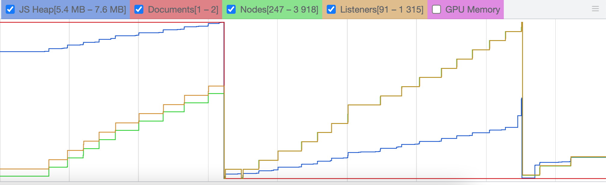

이번 포스팅에서는 JS의 메모리 구조, Chrome DevTools의 메모리 관련 기능들 그리고 메모리 누수 진단 및 해결 방법에 대해 작성하려고 한다. 현재 진행 중인 칸반보드 기능을 제공하는 웹앱이 성능 측면에서 눈에 띌 정도의 문제는 없지만, 메모리 누수를 해결하는 경험이 나중에 활용할 기회가 많을 것 같으로 생각했다. 따라서 Chrome DevTools로 메모리 관련 기능을 학습하고 이를 개선하는 과정을 기록하고자 한다.

## Intro

<div align="center">
  
</div>

개인 프로젝트로 진행한 JavaScript와 번들링 도구를 활용해 개발한 칸반보드 웹앱이다. 사용자는 항목 추가 버튼를 사용해 칸반보드 아이템을 추가할 수 있으며, 드래그 앤 드랍을 통해서 아이템을 이동시킬 수도 있다.

이 웹앱을 개선하기 위해서 먼저 메모리 누수에 대해서 학습 후, 개선의 여지가 있는 항목들을 Chrome DevTools를 활용해 진단하고 리펙토링을 통해 개선했다. 먼저 메모리 누수의 항목에 대해서 알아보았다.

## 메모리 누수의 3가지 유형

다음과 같은 3가지 유형 중 하나를 겪고 있다면 메모리 누수일 가능성이 있다.

### 1. 페이지가 시간이 지남에 따라 느려진다.

처음에는 페이지가 느리단 걸 인식하지 못하지만, 시간이 지남에 따라 느리다고 느껴지는 경우 메모리 누수, 즉 메모리릭(Memory Leak)이 발생한다고 볼 수 있다.

### 2. 페이지가 일관되게 느리다.

페이지가 처음부터 느리다고 느껴진다면, 이는 Memory bloat으로 볼 수 있다. Memory bloat은 페이지가 최적화된 속도에 필요한 메모리보다 기본적으로 더 많은 메모리를 사용하는 것을 말한다.

### 3. 페이지가 끊긴다.

페이지가 뚝 뚝 끊기는 현상은 가비지 콜렉션(Garbage Collection)이 너무 자주 일어날 때 발생한다. GC는 사용하지 않는 메모리를 해제하는 역할을 하는데, GC가 도는 시점은 브라우저가 결정한다. GC가 돌면 모든 JS 스크립트의 실행이 중지된다. 즉, GC가 자주 돈다는 것은 JS 스크립트의 실행이 자주 멈춘다는 의미이다.

## **메모리 누수 예제들**

다음과 같은 상황에서 메모리 누수가 발생할 수 있다.

- 클로저의 잘못된 사용
- 의도치않게 생성된 전역 변수
- 분리된 DOM 노드
- 콘솔 출력
- 해제하지 않은 타이머

칸반보드 웹앱에서는 클로저, 분리된 DOM 노드가 원인이 될 수 있을 것으로 판단하고 Chrome DevTools를 활용해 진단했다.

## Chrome performance profiling

**Chrome DevTools에서 Performance > Memory** 체크박스 선택 후 **Record** 버튼을 누르면 시간에 따른 메모리 사용량을 시각화해서 보여준다.

<div align="center">
  
</div>

위 그래프를 살펴보면 JS Heap, Documents, Nodes, Listeners가 모두 계단식으로 증가하고 있다. 이를 바탕으로 다음과 같은 문제가 있다는 것을 인식할 수 있다.

- JS Heap에서 메모리 누수가 발생하고 있다.
- 할당된 Listeners가 해제되지 않고 있다.
- Documents, Nodes가 계속 쌓여간다. 즉, detached DOM들이 존재한다.

## Allocation Timeline 활용해 JS 메모리 누수 디버깅하기

JS Heap에서 발생한 메모리릭을 살펴보려면 Chrome DevTools에서 **Memory** > **Profiles** > **Allocation instrumentation on timeline** 을 선택한 뒤 **`Start`** 버튼을 눌러 분석을 시작할 수 있다. 메모리릭을 발생시킬 것으로 의심되는 액션을 몇 차례 수행한 뒤, **`Stop`** 버튼을 눌러 분석을 종료하니 다음과 같은 화면을 볼 수 있었다.

<div align="center">
  
</div>

왼쪽 패널은 분석 결과 목록을 나타내고 오른쪽 패널은 시간에 따른 메모리 사용량과 관련 정보를 보여준다. 그래프를 보면 드래그 앤 드랍 이벤트를 발생시킨 후 파란색 막대가 생겼는데, 파란 막대는 해당 순간의 메모리 할당을 나타낸다. 회색 막대는 메모리 해제를 의미한다. 파란색 부분을 확대해 살펴보면 어떠한 원인으로 인해 메모리가 해제되지 않았는지 알 수 있다. 위에서 언급했듯 해당 웹앱의 체감할 정도의 성능상 이슈는 존재하지 않았기 때문에 파란색 막대가 여러개 나타나지는 않았다.

위에 보이는 파란색 막대 중 하나를 확대해보면 메모리 해제가 되지 않은 원인에 대해서 알 수 있다. 그 중 closure 항목을 클릭해서 세부항목을 살펴보면 다음과 같다.

<div align="center">
  
</div>

Item이 생성될 때마다 EventListener가 생성되고 있었으며, 이벤트 핸들링 콜백은 클로져를 생성하고 있었다. 따라서 이를 해결하기 위해서는 이벤트를 최적화할 필요가 있었으며 이에 대한 해결 방법은 밑 문단에서 다루었다.

## Removing Event Listeners on unmount

칸반보드에는 다양한 EventListener가 존재한다. 예를 들면 아이템을 선택하고 이동하는 경우에`dragstart`, `dragenter`, `dragleave`가 발생한다. 이외에도 다양한 이벤트들이 존재한다. 처음에 설계할 때는 다양한 이벤트 리스너를 직접 아이템에 부착해주는 방식을 사용했다. 복잡한 이벤트가 빈번하게 발생하고, 컴포넌트가 생성되는 경우 생명주기 중 이벤트 리스너를 추가해주는 과정이 존재했기 때문에 문제가 없다고 생각했다. 다음은 리팩토링을 진행 전 칸반보드의 아이템을 30번 드래그 앤 드랍 이벤트을 발생시킨 후 측정한 Performance Profiling 결과이다.

<div align="center">
  
</div>

칸반보드에서 아이템을 이동시킬 때마다 Nodes와 Listeners가 계단식으로 증가하는 것을 확인할 수 있다. 이를 해결하기 위해서는 생성되는 이벤트 리스너의 개수를 줄여줄 필요가 있었고, 이를 위해 이벤트 위임 기법을 활용했다. 아이템에 부착된 이벤트 리스너를 전부 제거하고 이를 칸반보드 컴포넌트로 위임했다. 이 때 다음과 같이 `closest` 와 이벤트 핸들러를 조합해서 이벤트 핸들링에 대한 분기처리를 수행했다. 다음은 `drop` 이벤트에 대한 분기처리 코드 예시이다.

```jsx
kanbanSelector.addEventListener('drop', ({ target }) => {
  target.closest('.contour-top') &&
    this.handleDropAtTopSection(target.closest('.contour-top'))
  target.closest('article') &&
    this.handleDropBetweenItem(target.closest('article'))
  target.dataset.id === 'column' &&
    this.handleDropAtEmptySection(target.dataset)
})
```

그리고 unmount 될 경우 기존에 부착했던 모든 EventListener를 제거해주었다. 이를 통해 다음과 같은 결과를 얻을 수 있었다. 기존에는 Listeners의 개수가 91-1315개였지만 26-89개로 줄어든 것을 확인할 수 있었다.

<div align="center">
  
</div>

기존에 잘못 설계된 이벤트 리스너 활용방식을 이벤트 위임 방식을 해결하기 위해 20개 이상의 커밋을 작성했다. 눈에 띄는 차이를 만들 수 있어서 리팩토링하는 재미를 느낄 수 있었다. 다음은 관련한 [커밋 내역](https://github.com/ingong/VanillaJS-SPA/commits/main)이다.

<div align="center">
  
</div>

## Debugging Detached DOM with Heap Snapshots

JS Heap에서 발생한 메모리릭을 살펴보기 위해서 **Allocation instrumentation on timeline**을 확인했고, 파란 막대에서 detached된 DOM Node에 대해서 확인할 수 있었다.

<div align="center">
  
</div>

해당 코드는 아이템이 제거된 후에도 여전히 참조를 유지하고 있기 때문에 아직 메모리에서 해제되지 않고 있었다.작성된 코드에서 DOM 노드를 탐색하는 코드를 분석한 결과 아래와 같은 코드들이 빈번하게 사용되고 있는 것을 발견했다. 처음 개발을 진행하는 시점에 가독성을 높인다는 이유로 selector로 탐색한 후 관련한 변수를 선언해주었었다. 이는 해당 노드가 사라진 후에도 참조를 유지하고 있기 때문에 문제가 되었다.

```jsx
// helper.js
const qs = (selector, scope) => document.querySelector(selector, scope)

// components/KanbanColumn/item.js
const itemSelector = qs(`.${this.$state.id}`)
const useRefSelector = qs('.useRef')
const deleteBtnSelector = qs('.item__delete', itemSelector)
const modifyBtnSelector = qs('.item__modify', itemSelector)
```

이를 해결하기 위해서 반복적으로 사용하는 DOM 노드에 대한 참조의 경우에만 변수를 선언하고 이외의 경우에는 DOM 노드에 대한 참조를 선언하지 않았다. 또한 좀 더 명확한 차이를 체감하고 싶어서 선언한 DOM 노드 참조에 대해서는 사용 후에 명시적으로 null을 대입해주었다. 이를 해결한 후 최적화 후와 최적화 전에 대한 Heap Snapshot을 비교해보았다. 두 Heap SnapShot을 비교한 결과 새로 생성한 hr, span, p 태그를 제외하면 모두 감소한 것을 확인할 수 있었다.

<div align="center">
  
</div>

## **Recap**

이번 포스팅에서는 Chrome DevTools를 활용하여 메모리릭 이슈를 해결한 과정을 소개하였다. 여기서 해결한 문제와 각각에 해당하는 진단 및 해결 방법은 다음과 같다.

- **JS Heap memory leak & Event Listeners memory leak**
  - **Memory Allocation Timeline와 Chrome Performance Profiling**으로 진단 후 이벤트 위임을 활용해 이벤트 바인딩을 최소화하고, 컴포넌트 언마운트 시 이벤트 리스너 제거
- **detached DOM memory leak**
  - **Chrome Memory Heap Snapshots**로 진단 후 DOM 노드 참조 선언 코드 제거

## reference

- [Chrome Developers - Record heap snapshots](https://developer.chrome.com/docs/devtools/memory-problems/heap-snapshots/)
- [Chrome Developers - Memory terminology](https://developer.chrome.com/docs/devtools/memory-problems/memory-101/)
- [당신이 모르는 자바스크립트의 메모리 누수의 비밀](https://ui.toast.com/weekly-pick/ko_20210611)
- [Chrome DevTools로 JS 메모리 누수 디버깅하기](https://blog.eunsukim.me/posts/debugging-javascript-memory-leak-with-chrome-devtools)
- [자바스크립트에서 메모리 누수의 4가지 형태](https://itstory.tk/entry/자바스크립트에서-메모리-누수의-4가지-형태)
- [리펙토링을 통해 개선한 프로젝트 Github](https://github.com/ingong/VanillaJS-SPA)
