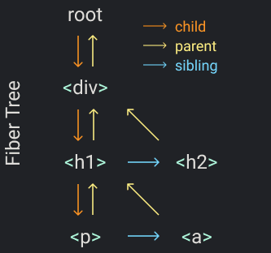

<div align="center">
  
</div>

> 이 포스팅은 [Build your own React](https://pomb.us/build-your-own-react/) 를 읽고 학습한 내용을 정리한 글 입니다.

## concepts

브라우저(렌더러 프로세스)의 메인 스레드는 변경 사항을 사용자의 화면에 적용하는 역할을 수행한다. 변경 사항은 CSS, 사용자 입력, 자바스크립트 등에 의해 유발될 수 있다.

현대의 디바이스에서는 최고의 사용자 경험을 제공하기 위해 초당 60프레임(FPS)에 렌더링될 것을 기대한다. 이를 위해서는 각 렌더링마다 코드가 실행되는데 16.67밀리초 미만이 걸려야한다. 만약 해당 frame에 렌더링하지 못한다면 page jank가 발생하고 사용자가 버벅거림을 느끼게 된다.

리액트는 JavaScript기반이며 당연히 싱글스레드기반이기 때문에 동일한 문제를 겪는다. 리액트는 이를 Concurrent Mode를 통해 해결하려고 한다. Concurrent란 동시성을 의미하며, 동시성이란 프로그램을 독립적으로 실행할 수 있는 여러 조각으로 나누어 구조화하는 방식이다.

현재까지의 리액트는 재조정 과정을 한번 시작하면 이 과정이 끝나기 전까지는 이를 멈출 수 없다. 현대의 디바이스가 기대하는 수준을 넘어선 시간이 소요된다면 사용자는 좋지 못한 사용자 경험을 할 것이다. 예를 들면 사용자 입력에 따른 DOM요소 변경이 잦아 사용자의 키보드 입력이 즉시 UI에 나타나지 않을 수 있다.

## 설명적 렌더링

리액트는 동시성 모드를 통해 렌더링 과정을 더 작은 작업들로 나누고, 스케줄러를 활용해 중요도에 기반한 각각의 작업에 우선순위를 부여한다. 이를 통해 리액트는 다음과 같은 작업을 할 수 있다.

- 메인 스레드를 블록하지 않는다
- 동시에 여러 작업들을 처리하고, 우선 순위에 따라 각 작업들 간에 전환할 수 있다
- 최종 결과로 확정하지 않고도 부분적으로 트리를 렌더링할 수 있다

렌더링 과정이 더 이상 프로세스를 블록하지 않으므로 이는 설명적(imperative)이며, 이제 사용자가 키를 누르는 등의 더 높은 중요도를 가지는 작업이 실행되었을 때 렌더링이 나중으로 미뤄질 수 있다. 즉, 사용자 입력에 대한 UI 반영이 더 높은 우선순위를 갖는 작업이 되고 더 빠르게 반영된다.

리액트는 **`requestIdleCallback()`** 함수를 사용하였다가 **`requestAnimationFrame()`**을 활용하는 방식으로 [변경](https://github.com/facebook/react/issues/11171)하였고, 현재 [scheduler 패키지](https://github.com/facebook/react/tree/main/packages/scheduler)를 사용한다. 이번 포스팅에서는 작업을 작은 단위로 쪼개는 개념은 동일하기 때문에 **`requestIdleCallback()`** 함수를 활용한다.

## Step III: Concurrent Mode

먼저 Element를 렌더링하는 작업을 작은 단위로 나누자. 그래서 각 작업이 끝난 다음 브라우저의 상태를 확인해보고, 더 중요한 작업이 필요하다면 렌더링 작업을 잠시 멈추고 해당 작업을 수행하도록 하자.

```jsx
// 다음 렌더링 작업
let nextUnitOfWork = null

function workLoop(deadline) {
  let shouldYield = false
  while (nextUnitOfWork && !shouldYield) {
    // 다음 렌더링 작업을 수행하고, 다시 다음 렌더링 작업을 지정한다.
    nextUnitOfWork = performUnitOfWork(nextUnitOfWork)
    // 주어진 idle 시간이 1ms 보다 적다면 loop를 빠져나오고 다음 frame을 기다린다
    shouldYield = deadline.timeRemaining() < 1
  }
  requestIdleCallback(workLoop)
}
// 브라우저가 idle 상태일 때 workLoop를 호출하도록 한다
requestIdleCallback(workLoop)

function performUnitOfWork(nextUnitOfWork) {
  // TODO: add dom node
  // TODO: create new fibers
  // TODO: return next unit of work
}
```

**`nextUnitOfWork`** 에는 다음 렌더링할 작업을 저장하고, **`performUnitOfWork()`** 함수에 전달하여 렌더링한 뒤 다음 렌더링 작업을 선정하여 반환하도록 하자.

**`requestIdleCallback()`** 함수는 매 frame마다 main thread가 idle한 때에 callback 함수를 실행할 수 있도록 한다. argument로 받은 함수에 **`deadline`** 파라미터를 전달한다. 이 파라미터의 메서드를 통해 현재 프레임에서 남은 idle 시간이 얼마인지 계산할 수 있는데, 여기서는 1ms 보다 적으면 더 이상 렌더링 작업을 하지 않고 다음 frame에서 진행하도록 루프를 빠져나오게 한다.

**`requestIdleCallback`**에 대한 내용이 잘 이해가 되지 않아서 공부해봤다. MDN 문서에 따르면 **`window.requestIdleCallback()`** 은 브라우저의 idle 상태에 호출될 함수를 대기열에 넣는 메서드이다. 대기 시간이 중요한 이벤트에 영향을 미치지 않고 메인 이벤트 루프에서 백그라운드 및 우선 순위가 낮은 작업을 수행할 수 있게 해준다. 이 메서드의 콜백 함수의 경우 **`deadline`** 객체를 인자로 전달받는데, 이를 통해 타임아웃 기간이 만료되어 callback이 실행되었는지 여부를 알 수 있다.

## Step IV: Fibers

다음 단계는 Fiber이다. Fiber는 실제 렌더링 작업을 나눈 작업 단위를 표현하는 자료구조이다. Fiber의 주요 목표는 React로 하여금 스케줄링에 있어 강점을 갖도록 하는 것이다. Fiber는 아래 항목들을 수행할 수 있어야한다.

- 작업을 중단하고 나중에 다시 돌아올 수 있어야 한다.
- 다른 종류의 작업에 우선순위를 부여할 수 있어야 한다.
- 이전에 완료된 작업을 재사용할 수 있어야 한다.
- 더 이상 필요 없어지면 작업을 중단할 수 있어야 한다.

즉, Fiber를 통해 언제든지 렌더링 작업을 중지했다가 다시 작업할 수 있도록 하는 것이다. 즉, 렌더링 작업이 다른 우선순위가 높은 작업에 의해 뒤로 밀려나더라도 브라우저가 **다음 렌더링 작업을 쉽게 찾을 수 있도록 하는 것**
이다.

하나의 element에 대해 하나의 fiber가 대응되고, 이 fiber가 바로 위에서 정의한 **`nextUnitOfWork`**
가 된다. JSX를 render할 때 제일 먼저 root element에 대한 fiber를 생성하고, **`nextUnitOfWork`**
로 지정한다. 그런 다음 **`performUnitOfWork()`** 함수를 호출하여 다음 작업들을 처리해나간다. **`performUnitOfWork()`**함수는 다음 순서로 동작한다.

1. 주어진 element에 대한 DOM을 생성하고 DOM tree에 붙인다.
2. 주어진 element의 children에 대해 fiber를 생성한다.
3. 새롭게 **`nextUnitOfWork`**를 지정한다.

이해를 돕기 위해 다음과 같은 DOM tree가 있다고 생각해보자.

<div align="center">
  
</div>

위 트리에서 **`<div>`** fiber를 **`performUnitOfWork()`** 로 전달하면 해당 element에 맞는 DOM 노드를 생성하고 root에 붙인다. 그런 다음 children인 **`<h1>`**, **`<h2>`**element에 대응되는 fiber를 생성한다. 마지막으로 **`<h1>`** fiber를 **`nextUnitOfWork`**로 선정하고 종료한다. **`nextUnitOfWork`**를 선정하는 과정은 먼저 child가 있는지, sibling이 있는지 확인하고 없다면 parent로 올라가 root에 도달할 때 까지 이를 반복한다. 즉 위 트리에서 **`nextUnitOfWork`**로 선정되는 순서는 **`<div>`** -> **`<h1>`** -> **`<p>`** -> **`<a>`** -> **`<h2>`**가 된다.

위 과정을 코드로 옮겨보자. 우선 우리가 만든 **`render`** 함수에서 dom을 생성하는 부분만 함수로 추출하자.

```jsx
// render 함수 안에서 DOM 노드를 생성하는 로직만 분리한다
function createDom(fiber) {
  const dom =
    fiber.type == 'TEXT_ELEMENT'
      ? document.createTextNode('')
      : document.createElement(fiber.type)

  const isProperty = key => key !== 'children'
  Object.keys(fiber.props)
    .filter(isProperty)
    .forEach(name => {
      dom[name] = fiber.props[name]
    })

  return dom
}
```

그리고 **`render`** 함수는 root element에 대한 fiber를 생성하고 **`nextUnitOfWork`**로 지정한다.

```jsx
let nextUnitOfWork = null
function render(element, container) {
  // element를 next unit of work로 선정한다.
  nextUnitOfWork = {
    dom: container,
    props: {
      children: [element],
    },
  }
}
```

다음으로 **`performUnitOfWork()`** 함수를 단계별로 작성하자. 먼저 fiber에 대한 DOM을 생성하고 **`dom`** 프로퍼티에 저장한다. 현재 fiber의 parent가 있다면 **`.appendChild()`**하여 DOM tree에 붙인다.

```jsx
function performUnitOfWork(fiber) {
  // add dom node
  if (!fiber.dom) fiber.dom = createDom(fiber)
  if (fiber.parent) fiber.parent.dom.appendChild(fiber.dom)
  // TODO: create new fibers
  // TODO: return next unit of work
}
```

다음으로 현재 fiber의 children을 순회하면서 각 child element에 대한 fiber를 생성한다. Fiber tree를 만들기 위해 각 fiber의 child, sibling 필드에 이를 저장한다.

```jsx
function performUnitOfWork(fiber) {
  // ...add dom node(생략)
  // create new fibers
  const elements = fiber.props.children
  let index = 0
  let prevSibling = null

  while (index < elements.length) {
    const element = elements[index]
    const newFiber = {
      type: element.type,
      props: element.props,
      parent: fiber,
      dom: null,
    }

    // 첫 번째 index 라면 자식, 아니라면 이전 형제자매로 fiber 추가
    if (index === 0) fiber.child = newFiber
    else prevSibling.sibling = newFiber

    prevSibling = newFiber
    index++
  }
  // TODO: return next unit of work
}
```

마지막은 탐색 작업이다. 자식, 형제자매, 부모의 형제자매 순서로 탐색을 진행한다. root fiber에 도달하여 더 이상 parent 가 존재하지 않는다면 종료한다.

```jsx
function performUnitOfWork(fiber) {
  // ...add dom node(생략)
  // ...create new fibers(생략)
  if (fiber.child) return fiber.child
  let nextFiber = fiber
  while (nextFiber) {
    if (nextFiber.sibling) return nextFiber.sibling
    nextFiber = nextFiber.parent
  }
}
```

## Step V: 렌더와 커밋 단계 (Render and Commit Phases)

하지만 문제가 있다. 엘리먼트에서 작업을 수행시마다 각각의 DOM에 새로운 노드를 추가해주고 있다. 브라우저가 렌더링이 진행되고 있는 중간에 난입할 수 있기 때문에 이 경우 유저는 미완성된 UI를 보게 된다. 이를 해결하기 위해 DOM을 변형시키는 부분을 제거한다.

**`performUnitOfWork()`**함수에서 parent fiber에 현재 fiber의 DOM 노드를 append 하는 로직을 제거하자.

```jsx
function performUnitOfWork(fiber) {
  // add dom node
  if (!fiber.dom) fiber.dom = createDom(fiber)
  // if (fiber.parent) fiber.parent.dom.appendChild(fiber.dom)
}
```

대신 현재 root fiber tree의 현황을 파악하는 **`wipRoot`**(Working In Progress Root)를 만들고 렌더링 작업이 완료되었을 때, 즉 **`nextUnitOfWork`**가 존재하지 않을 때 이를 commit하여 DOM tree를 만들도록 한다.

```jsx
function render(element, container) {
  // wipRoot는 현재 렌더링중인 fiber tree의 root를 참조한다
  wipRoot = {
    dom: container,
    props: {
      children: [element],
    },
  }
  nextUnitOfWork = wipRoot
}

let nextUnitOfWork = null
let wipRoot = null
```

마지막으로 **`workLoop`** 에서 **`nextUnitofWork`**가 존재하지 않으면 **`commitRoot()`** 함수를 호출하여 재귀적으로 DOM tree를 만든다.

```jsx
function commitRoot() {
  commitWork(wipRoot.child)
  wipRoot = null
}
function commitWork(fiber) {
  if (!fiber) return
  const domParent = fiber.parent.dom
  domParent.appendChild(fiber.dom)
  commitWork(fiber.child)
  commitWork(fiber.sibling)
}

function workLoop(deadline) {
  // ...
  // nextUnitOfWork가 존재하지 않으면 현재 wipRoot를 commit 한다
  if (!nextUnitOfWork && wipRoot) commitRoot()
  requestIdleCallback(workLoop)
}
```

## Recap

리액트는 Fiber라는 자료구조를 활용해 렌더링 작업을 작게 나누고, 작업에 대한 우선순위를 부여해 더 중요한 UI업데이트가 먼저 발생할 수 있게 해준다. 이전에는 **`requestIdleCallback()`, `requestAnimationFrame()`** 을 사용했지만 현재는 **`scheduler`** 패키지를 사용한다.

해당 포스팅의 마지막에는 렌더와 커밋 단계에 대해서 다루었다. 리액트의 렌더는 실제 렌더링이 아니다. 이는 새로운 Virtual DOM을 생성하는 과정이다. 그리고 커밋이 실제로 이전 Virtual DOM과의 비교를 통해 실제 DOM에 반영하는 과정이다. 이 과정을 통해 UI업데이트를 통합해 수행하고 사용자가 불완전한 UI를 보는 것을 예방할 수 있다.

## reference

- [리액트 Concurrent Mode 번역글](https://velog.io/@cadenzah/react-concurrent-mode)
- [Github: Build Your Own React](https://github.com/pomber/didact/blob/master/didact.js)
- [React Fiber](https://immigration9.github.io/react/2021/05/29/react-fiber-architecture.html)
- [a deep dive into React Fiber internals](https://bumkeyy.gitbook.io/bumkeyy-code/frontend/a-deep-dive-into-react-fiber-internals)
