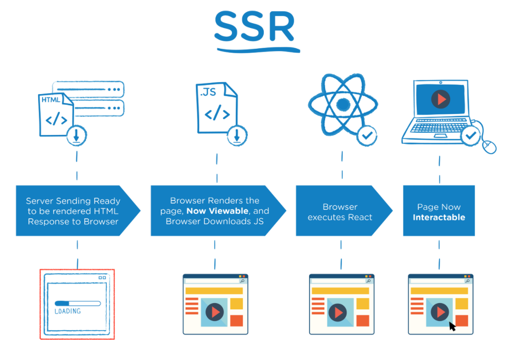

<div align="center">
  
</div>

이번 포스팅에서는 에 대해서 살펴보려고 한다.

### concepts

과거의 웹사이트들은 대부분 SSR로 동작했기 때문에 페이지가 여러 개로 구성된 Multi Page Form 방식을 사용했다. 하지만 스마트폰이 등장하면서 사용자들으 모바일 앱과 같은 사용성을 기대했다. 따라서 모바일 앱과 같은 형태의 웹페이지가 필요하게 됐다.

이를 해결하기 위해서 React, Vue와 같은 여러 라이브러리와 프레임워크가 생기게 되었고, CSR이 가능한 SPA가 등장하게 되었다. 기존의 MPA와 다르게 SPA는 1개의 페이지에서 여러 동작이 이루어진다.

처음 로드된 이후로는 좋은 사용자 경험을 제공할 수는 있지만 모든 기술이 그러하듯 CSR에도 단점이 존재한다. 먼저, 사용자가 페이지를 보기 까지 시간이 많이 소요된다는 점이다. 모든 리소스와 빈 html을 클라이언트 측에 넘기고 클라이언트에서 이를 렌더링하기 때문에 렌더링이 완료되기 전까지 빈 화면을 보게 된다. 또한 SEO 문제가 있다. 구글의 검색 엔진의 경우 JS가 로드되지 않는 페이지를 검색엔진으로 스캔해 결과적으로 검색에 아무 페이지도 걸리지 않는다. 이는 검색 엔진에 노출이 필요한 웹 사이트에게는 치명적인 단점이다.

이를 다시 해결하기 위해 1990년 중반에 활용했던 static sites의 영감을 받은 SSR 즉, 서버 사이드 렌더링이 도입되었다. Multi Page Application 에서 CSR 을 거쳐 다시 SSR로 돌아온 것이다. 이제 SSR에 대해서 알아보자.

## SSR

SSR은 서버에서 데이터를 가지고 html 파일을 만들고, 이를 동적으로 제어할 수 있는 일부 소스코드와 함께 클라이언트 측으로 보내준다. 클라이언트 측에서는 만들어진 html 파일을 받아와 사용자에게 보여줄 수 있게 된다.

SSR의 과정을 살펴보면 다음과 같다.

1. User가 WebSite 요청을 보낸다.
2. Server는 ‘Ready to Render’. 즉, 즉시 렌더링 가능한 `html` 파일을 만든다. 리소스를 체크하고 컴파일 후 완성된 HTML 컨텐츠로 만든다.
3. 클라이언트에 전달되는 순간 이미 렌더링 준비가 되어있기 때문에 HTML은 즉시 렌더링된다. 하지만 JS가 읽히기 전이기 때문에 사이트 조작이 어렵다.
4. 클라이언트가 자바스크립트를 다운받는다.
5. 다운받아지고 있는 사이에 유저는 컨텐츠를 볼 수 있지만 사이트를 조작할 수는 없다. 이 때 사용자 조작이 발생한다면 이 조작을 기억하고 있는다.
6. 브라우저가 JavaScript 라이브러리를 실행한다.
7. JavaScript가 성공적으로 컴파일 되었다면 기억하고 있던 사용자 조작이 실행된다. 이 시점에 웹 페이지는 상호작용 가능해진다.

이제 SSR의 **장점**을 살펴보자.

1. CSR에 비해 사용자는 빠르게 페이지를 볼 수 있다.
2. 서버 측에서 만들어진 html이 검색엔진에 노출되어 SEO에 좀 더 효율적이다.

모든 기술이 그러하듯 당연하게 **단점** 또한 존재한다.

1. 블링킹 이슈 (blinking issue)
   페이지 이동시 해당하는 페이지를 서버에서 받아오기 때문에 CSR에 비해 사용자 경험이 낮다.

2. 서버 과부화
   CSR방식은 사용자의 요청에 따라 페이지를 클라이언트에서 변경하고, 필요한 데이터는 서버에서 JSON의 형태로 전달받는 형태이기 때문에 서버에 대한 부하가 상대적으로 적다. 하지만 SSR은 html페이지를 요청하고 응답받기 때문에 상대적으로 서버에 부하를 줄 확률이 더 높다.

3. 서비스의 동적 활용에 딜레이가 있다.
   위에서 언급했듯이 SSR은 일부 소스코드와 함께 html파일을 클라이언트 측에 보낸다. 모든 코드를 보내지는 않았기 때문에 어떤 기능을 사용하기 위해서는 서버에서 해당 동작을 위한 자바스크립트 파일을 요청해 다운로드 하는 시간이 필요하다. 따라서 사용자가 화면을 보고 있음에도 불구하고 사용자가 특정 액션을 취했을 때 원하는 요청을 수행하지 못하는 경우가 존재한다.

   이는 SSR의 경우 Web Vitals의 TTI와 TTV에 간극이 존재한다고도 표현된다. TTI는 Time to Interactive, TTV 는 Time to View를 나타내는데 해석되는 그래도 상호작용까지 걸리는 시간, 화면에 보이기 까지의 시간을 나타낸다. 즉, SSR의 경우 TTV < TTI 이다. CSR의 경우 TTV = TTI 이다.
   여기서 [Web Vitals](https://web.dev/i18n/ko/vitals/)는 사이트 경험을 수량화하고 개선할 기회를 식별하는데 도움이 되는 Google의 지침서이자 도구이다. 이 도구를 통해 사이트의 메트릭을 측정하고 개선하는 과정을 통해 사용자 경험을 개선시킬 수 있다.

## Next.js

Next.js는 React의 SSR을 쉽게 구현할 수 있게 도와주는 프레임워크이다. React로도 자체적으로도 구현이 가능하지만, 개발환경을 만들기 위해서는 생각보다 복잡하다. 이를 해결하기 위해서 Next.js가 등장했다.

## Next.js의 data fetching: SSR, SSG, ISR

### SSR(Server Side Redering): getServerSideProps

전통적인 SSR를 위한 방법이다. `getServerSideProps` 를 통해 서버 단에서 API 요청을 보내서 필요한 데이터를 확보한 다음, 그 데이터를 주입한 HTML을 만들어서 클라이언트에게 넘긴다.

매 요청마다 API요청을 수행하기 때문에 최신의 정보를 받아올 수 있지만, 캐싱이 어렵고 DB에 자주 접근하게 된다는 단점이 있다.

### SSG(Static Site Generation): getStaticProps

필요한 정적 페이지를 빌드 타임에 만들어내는 방식이다. `getStaticProps` 를 통해 내부에서 API 요청을 할 수 있다.

캐싱이 용이하고 성능이 좋지만, 데이터가 빌드 타임 시점에 고정되기 때문에 데이터를 변경시키기 위해서는 해당 페이지나 전체 웹사이트를 재빌드하고 재배포해야한다.

Next.js가 제공하는 dynamic route를 사용하는 정적 페이지의 경우에는 어떻게 적용할 수 있을까? 이럴때는 `getStaticPaths` 를 사용해야 한다. 이 때 `getStaticPaths` 는 반드시 `getStaticProps` 와 함께 사용되어야하며, 어떤 route에 대해서 pre-render할 지 결정해야한다.

```jsx
export async function getStaticPaths() {
  const dogList = await getDogCard()

  // paths라는 변수가 어떤 route의 페이지들을 pre-render할지 미리 정해준다.
  const paths = dogList.map(dog => {
    const { _id, name, age, gender } = dog

    return {
      params: { _id, name, age, gender },
    }
  })

  return {
    paths,
  }
}
```

만약 해당 페이지가 아직 존재하지 않는 상황이라면 `fallback: “blocking”` 옵션을 부여해서 빌드 타임에 생성되지 않는 정적 페이지들은 최초 요청 시 SSR로 fallback하고 그 다음부터는 정적 페이지처럼 행동하게 할 수 있다.

```jsx
// getStaticPaths의 return 값에 fallback: "blocking"옵션을 추가
return {
  paths,
  fallback: 'blocking',
}
```

getStaticPaths의 return 값 중 fallback에 true와 blocking 값에 따른 동작 원리가 이해가 잘 되지 않아서 좀 더 자세하게 다뤄보겠다.

### getStaticPaths: fallback option

getStaticPaths가 반환하는 return값은 paths와 fallback이다.

1. paths

어떤 path의 페이지들을 빌드 타임에 생성할지 정하는 배열이다.

`pages/users/[id].js`에서 `getStaticPaths` 함수가 아래와 같은 객체를 반환하면,

```jsx
// getStaticPaths
return {
  paths: [
    { params: { id: '1' } },
    { params: { id: '2' } }
  ],
  fallback: ...
}
```

Next JS는 `users/1`, `users/2` 페이지를 빌드타임에 생성하게 된다.

이 때 주의할 점들은 다음과 같다.

- 만약 파일명이 `pages/users/[userId].js` 였다면, `params` 객체도 `userId` 키값을 가지고 있어야한다.
- 파일명이 `pages/[...slug]`와 같이 catch-all 라우트를 이용중인 경우, `params` 객체는 `slug` 배열을 가지고 있어야한다.
- 파일명이 `pages/[[..slug]]`와 같이 optional catch-all 라우트를 이용중인 경우, `null` / `[]` / `undefined` / `false` 값을 넣어주면 루트 라우트를 렌더링하게 된다.

1. fallback

빌드 타임에 생성해놓지 않은 path로 요청이 들어온 경우 어떻게 할지 정한다. `boolean` 과 `‘blocking’` 값이 올 수 있다.

- `false`

`getStaticPaths` 가 반환하지 않는 모든 path에 대해서 404 페이지를 반환한다.

- `true`

`getStaticProps` 의 동작이 바뀌게 된다.

1. `getStaticPaths` 가 반환한 path들은 빌드 타임에 HTML로 렌더링된다.
2. 이외의 path들에 대한 요청이 들어온 경우, 404 페이지를 반환하지 않고 페이지의 fallback 버전을 먼저 보여준다.
3. 백그라운드에서 Next.js가 요청된 path에 대해서 `getStaticProps` 함수를 이용해 HTML파일과 JSON파일을 만들어낸다.
4. 백그라운드 작업이 끝나면 요청된 path에 해당하는 JSON 파일을 받아서 새롭게 페이지를 렌더링한다. 사용자 입장에서는 **fallback → 요청한 페이지**와 같은 순서로 화면이 변하게 된다.
5. 새롭게 생성된 페이지를 기존의 빌드시 프리렌더링 된 페이지 리스트에 추가한다. 같은 path로 온 이후 요청들에 대해서는 이때 생성한 페이지를 반환하게된다.

"fallback" 상태일 때 보여줄 화면은 `next/router`의 `router.isFallback`
 값 체크를 통해서 조건 분기하면 된다. 이때 페이지 컴포넌트는 `props`로 빈값을 받게된다.

```jsx
// pages/posts/[id].js
import { useRouter } from 'next/router'

function Post({ post }) {
  const router = useRouter()

  // If the page is not yet generated, this will be displayed
  // initially until getStaticProps() finishes running
  if (router.isFallback) return <div>Loading...</div>
  // Render post...
}
```

`fallback: true` 는 데이터에 의존하는 정적 페이지를 많이 가지고 있으나 빌드시에 모든 페이지를 생성하는것은 너무나 큰 작업일 때 사용한다. 몇몇 페이지들에 대해서는 빌드타임에 생성하고, 이후 요청이 오는 것에 따라서 정적 페이지를 추가하게 된다. 이를 통해 빌드 시간을 단축하고 사용자들의 응답 속도도 단축시킬 수 있다.

- `‘blocking’`

`true`일 경우와 비슷하게 동작하지만, 최초 만들어놓지않은 path에 대한 요청이 들어온 경우 **fallback 상태를 보여주지 않고 SSR처럼 동작**한다. 이후 `true`옵션과 같이 기존의 정적 페이지 리스트에 새로 생성한 페이지를 추가한다.

### ISR(Incremental Static Regeneration): getStaticProps + revalidation

ISR 방식은 일정 주기마다 데이터의 최신 여부를 검사하고 업데이트된 데이터로 페이지를 다시 생성한다. ISR을 적용하기 위해서는 기존 Next.js가 제공하는 `getStaticProps` API를 사용하되 revalidate 옵션만 부여해주면 된다.

```jsx
// pages/products/[id].js

export async function getStaticProps({ params }) {
  return {
    props: {
      product: await getProductFromDatabase(params.id),
    },
    revalidate: 60,
  }
}
```

Next.js 공식문서에 따르면 동작 방식은 다음과 같다. 이 때 revalidate 옵션 값은 60초이며, 이미 빌드된 쇼핑몰 웹 사이트라고 가정해보겠다.

1. 제품 페이지에 대한 첫 번째 요청에는 캐시된 페이지가 표시된다.
2. 제품의 데이터가 CMS에서 업데이트된다.
3. 첫 번째 요청 후 및 60초 창 전에 페이지에 대한 모든 요청은 캐시된(히트) 페이지를 표시한다.
4. 60초 후 다음 요청에는 캐시된(스테이) 페이지가 계속 표시됩니다. Next.js는 백그라운드에서 페이지 재생성을 트리거한다.
5. 페이지가 정상적으로 생성되면 Next.js는 캐시를 무효화하고 업데이트된 제품 페이지를 표시한다. 백그라운드 재생성에 실패해도 이전 페이지는 변경되지 않는다.

이 과정을 통해 사용자는 항상 정적 페이지를 받게 되고, 데이터 또한 빌드 타임에 고정되지 않게 된다.

## 언제 SSR, SSG, ISR을 써야 할까?

해당 내용은 이미지가 직관적인 것 같아 이미지로 대체한다.

<div align="center">
  
</div>

## Recap

이번 포스팅에서는 SSR과 CSR에 대해서 살펴보고, Next.js의 데이터 페칭에 대해서 살펴봤다.

- SSR vs CSR
- Nextjs
- Nextjs 의 DataFetching : SSR, SSG, ISR

Next.js로 프로젝트를 진행하면서 `getStaticPaths` 의 return 값에 대해서 궁금했었는데 이번 포스팅을 계기로 확실하게 학습할 수 있어서 유익했던 것 같다.

## reference

- [Next.js Docs: ISR](https://vercel.com/docs/concepts/next.js/incremental-static-regeneration)
- [박나희님 블로그: Next.js](https://kyounghwan01.github.io/blog/React/next/basic/#document-tsx)
- [김경환님 블로그: Next.js](https://kyounghwan01.github.io/blog/React/next/basic/#document-tsx)
- [김우영님 노션 페이지](https://www.notion.so/NextJS-691da688ecf44ae4bbae5dc49b8ba6c8)
- [mskwon.dev님 블로그: getStaticPaths fallback option](https://velog.io/@mskwon/next-js-static-generation-fallback)
