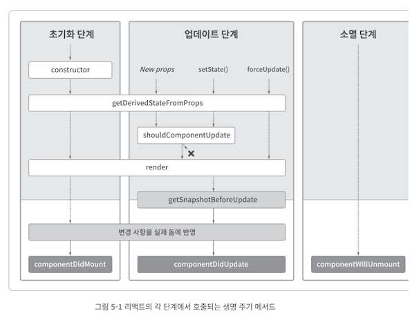

최근에는 클래스 컴포넌트 대신 함수형 컴포넌트가 사용되고 있다. 그래서 해당 내용을 학습할 기회가 없었다. 하지만 리액트의 초기 설계단계에서 사용된만큼 리액트가 의도한 바를 이해하는데 도움이 될 것 같다는 생각이 들었다. 따라서 이번 글에서는 클래스 컴포넌트의 생명주기 메서드에 대해서 다뤄보려고 한다.

## 클래스형 컴포넌트의 생명 주기 메서드

모든 컴포넌트는 3가지 단계를 가진다.

- 초기화 단계
- 업데이트 단계
- 소멸 단계

각 단계에서는 몇 개의 메서드들이 정해진 순서대로 호출된다. 각 단계 속에서 호출되는 메서드를 생명 주기 메서드라 한다.

<div align="center">
  
</div>

Render 단계를 브라우저의 렌더링과 혼동한 경우에 리액트의 메서드를 이해하는데 어려움이 있기 때문에 반드시 이 두 가지의 용어에 대한 정리가 필요하다. 이제는 초기화 단계, 업데이트 단계, 소멸 단계 각각을 알아보자.

## 초기화 단계

초기화 단계에서는 최초 컴포넌트 인스턴스(클래스 컴포넌트이므로 인스턴스라고 한다)가 생성될 때 딱 한 번 수행한다. 초기화 단계에서 수행되는 메서드는 다음과 같다.

1. `constructor()`
2. `static getDerivedStateFromProps()`
3. `render()`
4. `componentDidMount()`

### `1. constructor()`

초기 상태값을 정의할 수 있다. 다른 생명 주기 메서드에서는 상태를 변경하기 위해서는 setState 를 호출해야한다. 메서드를 바인딩하거나, state 를 초기화하는 작업이 없다면 constructor 를 호출할 필요가 없다. 이 생성자는 해당 컴포넌트가 마운트 되기전에 호출된다. `React.Component` 를 상속한 컴포넌트의 생성자를 구현할 때는 다른 구문에 앞서 `super(props)` 를 호출야한다. 그렇지 않으면 `this.props` 가 생성자 내에서 정의되지 않아 버그로 이어질 수 있다.

### `2. static getDerivedStateFromProps()`

최초 마운트 시와 갱신 시 모두에서 render 메서드를 호출하기 전에 호출된다. 시간의 흐름에 따라 변하는 props 에 state 가 의존하는 경우에 사용한다. 주로 애니메이션과 관련한 속성값으로부터 상태값을 계산할 경우에 유용하게 사용된다.

### `3. render()`

`render` 메서드는 반드시 작성해야하는 메서드이며, `render` 메서드의 반환값은 화면에 보여질 내용을 결정한다. 그리고 이는 props 와 state 으로만 결정되어야한다.

`render` 메서드는 부수 효과를 발생시켜서는 안된다. 서버와 통신 또는 브라우저에 쿠키를 저장하는 등의 효과는 부수 효과이므로 `render` 메서드 외에 다른 메서드에서 처리해야한다.

### `4. componentDidMount()`

`render` 메서드의 반환값이 실제 돔에 반영된 이후에 호출된다. 이 메서드는 API 호출을 통해 데이터를 가져올 때 적합하며 그 이유는 `setState` 메서드가 마운트 이후에만 동작하기 때문이다.

## 업데이트 단계

업데이트 단계는 초기화 단계와 소멸 단계 사이에서 반복해서 수행되며, 컴포넌트의 속성값 또는 상태값이 변경되면 업데이트가 수행된다. 업데이트 단계에서 실행되는 생명 주기 메서드는 다음과 같다.

1. `shouldComponentUpdate()`
2. `render()`
3. `getSnapshotBeforeUpdate()`
4. `componentDidUpdate()`

### `shouldComponentUpdate()`

이 메서드는 **성능 최적화**를 위해 존재한다. `shouldComponentUpdate(nextProps, nextState)` 의 메서드 구조는 다음과 같다. 이 메서드는 bool 값을 반환하며 참을 반환하면 `render` 메서드가 호출되고, 그렇지 않다면 `render` 메서드가 호출되지 않는다. 함수형 컴포넌트에서는 useMemo 를 통해 유사하게 동작하도록 구현할 수 있다.

```jsx
class Component extends React.Component {
  shouldComponentUpdate(nextProps, nextState) {
    const { price } = this.state
    return price !== nextState.price
  }
}
```

### `getSnapshotBeforeUpdate()`

이 메서드는 렌더링 결과가 실제 돔에 반영되기 직전에 호출된다. 이전 돔 요소의 상태값을 가져오기 좋다.

`getSnapshotBeforeUpdate()` 와 `componentDidUpate()` 사이에 VirtualDOM 이 실제 DOM 에 반영되는 Commit 단계가 일어난다.

`getSnapshotBeforeUpdate()` 의 메서드 구조는 다음과 같다.

```jsx
getSnapshotBeforeUpdate(prevProps, prevState) => snapshot
```

이 반환값은 `ComponentDidUpate` 메서드의 세 번째 인자로 들어간다. 따라서 이 메서드에서 이전 DOM 의 상태값을 반환하면, `componentDidUpdate` 메서드에서는 돔의 이전 상태값과 이후 상태값을 모두 알기 때문에 돔의 상태값의 변화를 알 수 있다.

### `componentDidUpate()`

이 메서드는 업데이트 단계에서 호출되는 마지막 생명주기 메서드이다. 구조는 다음과 같다.

`componentDidUpdate(prevProps, prevState, snapshot)`

해당 메서드는 가상 돔이 실제 돔에 반영된 후에 호출된다. 따라서 해당 메서드는 새로 반영된 돔의 상태값을 가장 빠르게 가져올 수 있는 생명주기 메서드이다.

## 소멸 단계

### `componentWillUnmount()`

이 메서드는 소멸 단계에서 호출되는 유일한 생명 주기 메서드이다. 끝나지 않은 네트워크 요청 취소, 타이머 해제, 구독 해제 등의 작업을 처리하기 좋다. `componentDidMount` 메서드가 호출되었다면 `componentWillUnMount` 도 호출이 보장된다.

## 에러 처리

### `static getDerivedStateFromError(error) & componentDidCatch(error, info)`

생명주기 메서드에서 에러가 발생한 경우 두 가지 메서드를 구현한 가장 가까운 부모 컴포넌트를 찾는다. error 는 전달된 에러 객체이며, info 는 어떤 컴포넌트에서 예외가 발생했는지 알려준다. getDerivedStateFromError 정적 메서드는 에러 정보를 상태값에 저장해서 화면에 나타내는 용도로 사용한다. componentDidCatch 는 에러 정보를 상태값에 저장해서 화면에 나타낼 수 있다. `componentDidCatch` 는 커밋 단계에 호출되기 때문에 부수 효과를 발생시켜도 된다.

## 정리

리액트에서 데이터 변경에 의한 화면 업데이트는 렌더 단계와 커밋 단계를 거친다. 렌더 단계에서는 실제 돔에 반영할 변경 사항을 파악하고, 커밋 단계에서는 파악된 변경 사항을 실제 돔에 반영한다. `concurrent` 모드에서는 렌더 단계에서 실행을 멈췄다가 나중에 다시 실행하는 과정에서 렌더단계에서의 같은 생명 주기 메서드를 여러 번 호출할 수 있다. 이러한 이유로 렌더단계에서는 부수효과를 발생시켜서는 안된다는 걸로도 추측할 수 있다.

우리가 함수형 컴포넌트에서 자주 사용하는 useEffect 훅도 ComponentDidMount 와 ComponentDidUpate 그리고 ComponentWillUnMount 의 생명주기 메서드와 유사하게 사용되기 때문에 우리는 커밋 단계에서 부수효과를 발생시키고 있었다는 것을 알 수 있다.

커밋단계에서 호출하는 메서드는 다음 4가지이다.`getSnapshotBeforeUpdate, componentDidMount, componentDidUpdate, componentDidCatch` 이다. 이 메서드를 제외하고는 렌더단계에서 호출된다. `concurrent` 모드에서도 커밋 단계에서의 메서드는 1회만 호출되기 때문에 에러 정보는 `componentDidCatch` 와 같은 에러 정보를 서버로 전송하는 메서드를 활용해 실행하는 것이 좋다. 만약 UI 에 반영하는 경우에는 `getDerivedStateFromError` 를 사용하면 된다고 한다.

## REFERENCE

- [리액트 조화 과정](https://velog.io/@dev-mish-mash/%EB%A6%AC%EC%95%A1%ED%8A%B8%EC%9D%98-%EC%A1%B0%ED%99%94Reconciliation-%EA%B3%BC%EC%A0%95-%EC%A0%95%EB%A6%AC)
- [Build Your Own React 관련 정리 글](https://blog.eunsukim.me/blog/2021-08-24---Build-your-own-React-Concurrency)
