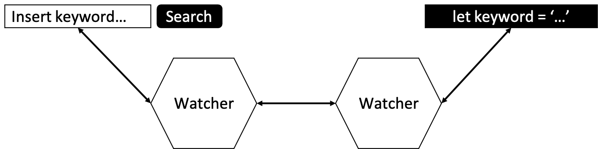
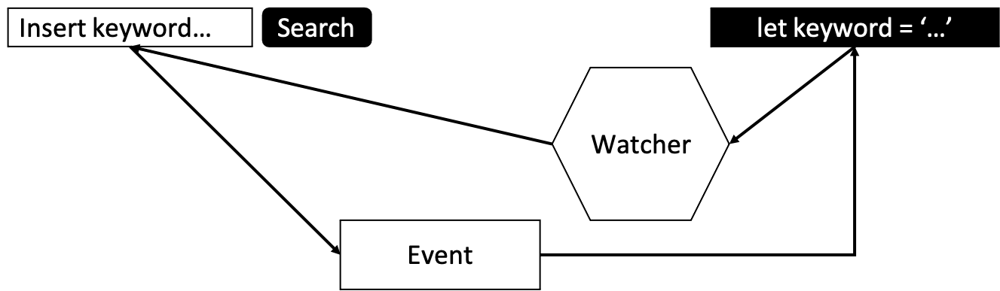

> 최근에 실패를 경험한 후 ‘나는 과연 리액트에 대해 깊이있게 이해하고 React라는 기술을 사용하고 있는가?’ 라는 질문을 스스로에게 던졌고, 나는 확신을 갖고 대답하지 못했다. 이 글은 리액트에 대해 깊이 있는 학습을 위해 작성하는 글이다.

## React.js란?

리액트는 SPA 또는 모바일 어플리케이션 UI 개발을 위해 사용하는 라이브러리다. 흔한 디자인 패턴 중 하나인 MVC 모델 기반 어플리케이션은 컨트롤러가 데이터와 뷰를 관리한다. 하지만 리액트는 특정 값에 의존해 자동으로 반응하는 리액티브(reactive)한 특징을 갖는다.

리액트의 컴포넌트는 뷰모델이 강하게 결합된 형태이다. 개발자는 상태 변경과 마크업 작업을 통해 컴포넌트를 생성할 수 있고 상태가 변경되면 자동으로 관련한 UI가 갱신된다.

## React.js의 특징

React.js의 특징을 정리해보면 다음과 같다.

1. React는 **컴포넌트** 기반으로 **재사용성**이 뛰어나다.
2. React 컴포넌트는 **state**와 **props**를 가진다.
3. React는 **단방향 데이터 바인딩**을 가진다.
4. React는 **Virtual DOM** 기반이다.
5. React는 **선언형**이다.

각자의 특징에 대해서 조금 더 자세하게 살펴보자.

### 1. React는 **컴포넌트** 기반으로 **재사용성**이 뛰어나다.

컴포넌트는 독립적인 단위의 소프트웨어 모듈을 말한다. 즉, 소프웨어를 독립적인 하나의 부품으로 만드는 개념이다.

리액트의 컴포넌트는 `props` 를 입력받아 리액트 엘리먼트를 만들어낸다. 엘리먼트(Element)는 리액트 앱을 구성하는 최소 단위를 나타낸다. 따라서 리액트는 웹에서 쓰는 각 요소들을 컴포넌트로 만들 수 있게 해 기존의 UI를 다른 화면에서 다시 쓰거나, 다른 페이지에서 다시 쓸 수 있도록 하는 장점(**높은 재사용성**)을 가진다.

### 2. React 컴포넌트는 **state**와 **props**를 가진다.

리액트 컴포넌트는 state와 props를 가진다. 이는 사용자의 동작(Actions)에 따라 상태에 기반한 다른 UI를 보여줘야하기 때문이다. 따라서 리액트를 잘 다루기 위해서는 state와 props에 대한 설계가 필요하다. 어떤 컴포넌트를 만들 때, 내부 컴포넌트에 어떤 State가 있을지, 페이지 전체에 어떤 State가 있는지 파악하고 개발을 진행해야한다.

해당 부분에 대해서는 모든 문제를 해결하는 황금 열쇠는 존재하지 않는다. 이는 다양한 상태 설계 경험과 구현 경험에서의 불편함을 느끼는 과정에서 향상시킬 수 있는 기능이라고 생각한다. 여러 사람과 협업하거나 프로젝트를 비교적 장기간 지속하는 과정에서 새로운 기능이 추가되거나, 변경 사항이 수정될 때 중복되는 구조가 생기고 이로 인해 코드가 복잡해지는 일이 생겼다. 이럴 때마다 설계의 중요성을 매번 다시 체감하게 된다.

### 3. React는 단방**향 데이터 바인딩**을 가진다.

데이터 바인딩은 UI와 해당 UI가 표시하는 데이터를 연결하는 프로세스이다. 단방향 데이터 바인딩의 상반되는 개념은 양방향 데이터 바인딩이다. 양방향 데이터 바인딩에 대해서 먼저 살펴보자.

- 양방향 데이터 바인딩

UI의 변경을 감시하는 Watcher와 데이터의 변경을 감시하는 Watcher가 UI와 데이터를 자동으로 동기화 시켜주는 방식이다. 이를 통해 프로그래머는 자바스크립트내에 데이터 변경과 사용자 UI에 데이터 변경에 관한 동기화를 신경쓰지 않고 프로그램을 작성할 수 있다.

  

하나에 데이터 동기화에 두 개의 Watcher가 사용되고, 데이터 많아지게 되면 이 데이터의 동기화를 위한 수많은 Watcher가 생성되어 성능 저하가 발생할 수도 있다.

- 단방향 바인딩

단방향 데이터 바인딩은 단 하나의 Watcher가 자바스크립트의 데이터 변화를 감지하고 사용자의 UI를 갱신한다. 사용자가 UI를 통해 자바스크립트의 데이터를 갱신할 때는 이벤트를 통해 갱신하게 된다. 이처럼 단방향 데이터 바인딩은 하나의 Watcher를 사용하기 때문에 양방향 데이터 바인딩이 가지는 성능적인 이슈를 해결하고 더 확실하게 데이터를 추적할 수 있게 해준다.

  

### 4. React는 **Virtual DOM** 기반이다.

리액트를 통해 데이터 관리를 하고 UI 반영까지 이뤄낼 수 있다. 이는 코드 양이 줄어들어 우리는 좀 더 우리가 원하는 결과에 집중해 코드를 작성할 수 있다. JavaScript 로 어플리케이션을 만드는 과정에서 상태 변화를 UI에 반영하기 위해서는 DOM API 호출은 불가피하다는 것을 알 수 있었다. 즉, 상태가 변하는 만큼 DOM API 호출은 이에 비례하고, 이는 브라우저 성능에 영향을 끼친다.

브라우저가 HTML과 CSS로 화면을 그리는 과정은 다음과 같다.

1. HTML 코드를 파싱해 DOM 트리를 만든다.
2. CSS 코드를 통해 CSSOM 트리를 만든다.
3. 두 트리를 합쳐 렌더트리(화면에 보이는 요소)를 만든다.
4. 레이아웃을 계산한다. (뷰포트를 기준으로 노드의 정확한 위치와 크기 계산)
5. 페인트 (렌더트리의 각 노드를 화면상의 실제 픽셀로 변환, 여러 Layer 로 관리)
6. Composite (여러 Layer 를 순서대로 합성해 사용자의 화면에 보여준다)

주요 렌더링 경로라고 불리는 이 과정에서 JS 로 DOM API 를 호출해 DOM 을 조작하면 리플로우(레이아웃 과정을 다시 수행하는 것)를 발생시킨다. 이는 렌더링 성능에 영향을 주는 요소가 된다. 따라서 이를 줄이는 방법은 렌더링 성능을 올릴 수 있는 방법이다. 이러한 배경에서 등장한 것이 가상돔이다.

리액트는 트리 구조의 돔과 유사한 가상돔을 만들어 메모리에서 관리한다. 어플리케이션에서 화면에 변경 요소가 생기면 이를 직접 요청하는 것이 아니라 가상돔에 요청한다. 가상돔은 이전에 만들어진 가상돔과의 비교를 통해 변화된 요소만 DOM 에 반영하고, 변화를 한 번에 반영하는 배칭 등의 기법을 활용해 DOM 접근을 최소화시킨다.

### 5. React는 **선언형**이다.

리액트는 선언형 성격에 맞게 원하는 엘리먼트를 반환하는 컴포넌트를 jsx 문법을 통해 구현한다. 어떻게 엘리먼트가 UI에 반영되고, jsx 문법은 어떤 방식으로 동작하는지보다는 우리가 얻고 싶은 엘리먼트에 집중할 수 있게 한다. 이미 리액트는 해당 컴포넌트의 변경사항을 Fiber를 사용해 체크하고 리-렌더링 여부를 결정한다.

이와 같은 선언형 특성은, 리액트를 사용할 때 화면 설계라는 초점에 맞춰서 개발할 수 있도록 해주므로, 다른 부분에 대한 고민을 최소화 해주어 **높은 생산성**을 보장할 수 있도록 해준다.

### 맺음말

최근 블로그 글을 많이 작성하게 되면서 생각이 많이 정리되고 있음을 느끼고 있다. 내가 알고 있다고 착각하고 있는 지식들이 많다는 것 또한 느낄 수 있었다. 이번 리액트 글을 시작으로 리액트의 동작 원리에 대해서 학습해봐야겠다.

### REFERENCE

- [dev-yakuza 블로그](https://dev-yakuza.posstree.com/ko/react/create-react-app/react/)
- [Stark Jeon Medium 블로그](https://medium.com/react-native-seoul/react-%EB%A6%AC%EC%95%A1%ED%8A%B8%EB%A5%BC-%EC%B2%98%EC%9D%8C%EB%B6%80%ED%84%B0-%EB%B0%B0%EC%9B%8C%EB%B3%B4%EC%9E%90-01-react-js%EB%9E%80-%EB%AC%B4%EC%97%87%EC%9D%B8%EA%B0%80-ad8ba252ee28)
- [Learn you a React for good 글](https://environmentset.github.io/2019/02/13/Why-use-React/)
