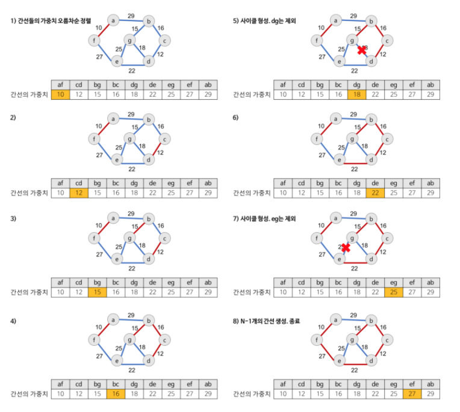

## 스패닝 트리

방향이 없는 그래프에서 모든 노드를 포함하면서 순환되는 경로를 제거한 형태의 트리를 스패닝 트리라고 한다. 이 스패닝 트리에서 가중치의 합을 최소로 만드는 스패닝 트리를 최소 스패닝 트리(MST)라고 한다.

## 크루스칼 알고리즘

그래프 알고리즘은 여러 객체들 사이에 짝을 이루는 관계를 모델링 하기 위해 사용되는 알고리즘 중 하나이다. 위에서 최소 스패닝 트리를 만들기 위한 방법에는 크루스칼 알고리즘과 프림 알고리즘이 있다. 이번 글에서는 크루스칼 알고리즘에 대해서 살펴보자.

크루스칼 알고리즘은 탐욕적인 방법(greedy method)을 이용해 네트워크의 모든 정점을 최소 비용으로 연결하는 최적 해답을 구하는 것이다. 크루스칼 알고리즘의 동작 과정은 크게 3가지로 요약할 수 있다.

1. 그래프의 간선들을 가중치의 오름차순으로 정렬한다.
2. 정렬된 간선 리스트에서 순서대로 사이클을 형성하지 않는 간선을 선택한다. 이 때 가장 낮은 가중치의 간선을 선택하되 사이클을 형성하지 않는 간선이여야한다.
3. 해당 간선을 최소 비용 신장 트리의 집합에 추가한다.

구체적인 동작 방식은 [다음 블로그의 그림](https://gmlwjd9405.github.io/2018/08/29/algorithm-kruskal-mst.html)을 참고하자.

<div align="center">
  
</div>

[권희정님] Kruskal 알고리즘이란

시간 복잡도는 엣지(Edge) 를 정렬하는데 E _ logE (퀵소트)만큼의 시간이 소요되고 간선에 대해서 탐색하므로 E 만큼의 시간이 소요된다. 따라서 시간 복잡도는 E _ log E 라고 할 수 있다. 사이클 여부를 확인할 때는 Union-find 알고리즘을 활용하고 필자는 서로소 집합 자료구조를 선언해 활용했다. 서로소 집합에 대한 설명은 다음과 같다.

## 서로소 집합 (disjoint-set)

서로소 집합은 많은 서로소 부분 집합들로 나눠진 원소들에 대한 정보를 저장하고 조작하는 자료구조이다. 해당 자료구조는 크게 두 개의 유용한 연산을 제공한다.

`find` : 어떤 원소가 주어졌을 때 이 원소가 속한 집합을 반환한다. 이 때 해당 원소가 속한 집합을 대표하는 원소를 반환하는데 이를 위해서 어떤 원소와 각 대표 원소들과의 find 결과를 비교하여 같은 집합임을 판단한다.

`Union` : 두 개의 집합을 하나의 집합으로 합친다.

```jsx
class DisjointSet {
  constructor(n) {
    this.parent = Array.from({ length: n + 1 }, (_, i) => i)
  }

  union(n1, n2) {
    const rootA = this.find(n1)
    const rootB = this.find(n2)
    if (rootA < rootB) this.parent[rootB] = rootA
    else this.parent[rootA] = rootB
  }

  find(node) {
    if (this.parent[node] === node) return node
    this.parent[node] = this.find(this.parent[node])
    return this.parent[node]
  }

  connected(n1, n2) {
    if (this.find(n1) != this.find(n2)) return false
    else return true
  }
}
```

먼저 본인의 index 로 배열을 초기화한다. union 연산에서는 대표하는 원소를 반환하는 find 연산 후 더 작은 값이 집합을 대표하도록 재할당한다.

- [얍문’s Coding World 님 블로그](https://yabmoons.tistory.com/186)
- [권희정님 블로그](https://gmlwjd9405.github.io/2018/08/29/algorithm-kruskal-mst.html)
