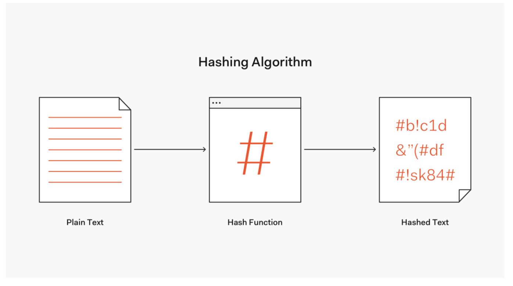
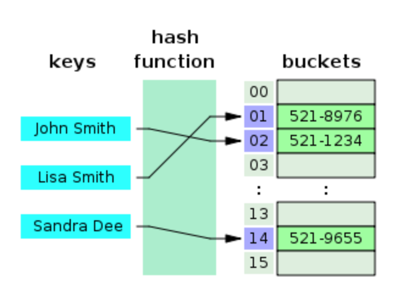

<div align="center">
  
</div>

이번 글에서는 해싱에 대해서 살펴보려고 한다. 해시 테이블과 이를 활용해 충돌을 해결하는 방법은 이전 선형 자료 구조에 대한 고찰에서 살펴봤다. 따라서 이번 글에서는 해시테이블에 대해서 간단하게 살펴보고, 해시 충돌 완화를 위한 해시 함수에 대해서 살펴보려고 한다.

## concepts

해시 함수란 **데이터의 효율적 관리를 목적**으로 임의의 길이의 데이터를 **고정된 길이의 데이터**로 매핑하는 함수이다. 이 때 매핑 전 원래 데이터의 값을 키(key), 매핑 후 데이터의 값을 해시 값(hash value), 매핑하는 과정 자체를 해싱(hashing)이라고 한다. 해시함수는 해시 값의 개수보다 많은 키 값을 해시 값으로 변환하기 때문에 해시충돌이 발생한다.

## 해시테이블의 장점

해시 충돌이 발생함에도 해시 테이블을 사용하는 이유는 적은 리소스로 많은 데이터를 효율적으로 관리할 수 있기 때문이다. 정말 많은 글에서 확인할 수 있었는데 클라우드나 하드디스크에 존재하는 무한에 가까운 데이터들을 유한한 개수의 해시값으로 매핑함으로써 작은 크기의 캐쉬 메모리로도 프로세스를 관리할 수 있다는 예시가 있다고 한다. 필자는 캐시 메모리에 대한 이해가 부족하다고 생각해 캐시 메모리의 개념과 동작 방식에 대해서 살펴보았다.

먼저, 캐시 메모리는 속도가 빠른 장치와 느린 장치에서 속도 차이에 따른 병목 현상을 줄이기 위한 메모리이다. 이는 크게 3가지 과정으로 동작한다.

1. 캐시 메모리는 CPU가 메모리에 데이터를 요청하기 전에 캐시 메모리에 접근해 데이터 존재 유무를 확인한다.
2. 만약 캐시 메모리가 해당 데이터를 가지고 있다면 `Cache Hit` 라고 칭하며 데이터를 빠르게 전송한다.
3. 캐시 메모리에 해당 데이터가 없다면 `Cache Miss`가 발생하고 CPU는 메인 메모리에 접근해 데이터를 요청한다.

작성하면서 생각해보니 해시 함수자체가 임의의 길이의 데이터를 고정된 길이의 데이터로 매핑하는 함수인데 고정된 길이의 데이터가 캐시 메모리를 나타낸다고 이해하면 될 것 같다. 제한적인 캐시 메모리에 저장하기 위해 기존 데이터를 해싱해서 캐시 메모리에 저장한 것이다.

다시 해시 테이블의 장점에 대해서 살펴보자. 해시 테이블을 사용하면 색인(index)에 해시값을 사용함으로써 모든 데이터를 살피지 않아도 모든 데이터를 살피지 않아도 검색과 삽입/삭제를 빠르게 수행할 수 있다.

해시함수는 언제나 동일한 해시값을 리턴하고, 해당 색인만 알면 해시테이블의 크기에 상관없이 데이터에 대단히 빠르게 접근할 수 있다. 또한 색인은 계산이 간단한 함수(상수시간)로 작동하기 때문에 매우 효율적이다. 다시 말해 해시는 데이터 액세스(삽입, 삭제, 탐색)시 시간복잡도 𝑂(1)를 지향한다.

## 해시 테이블

해시함수를 사용하여 키를 해시값으로 매핑하고, 이 해시값을 색인(index) 혹은 주소 삼아 데이터의 값(value)을 키와 함께 저장하는 자료구조를 **해시테이블(hash table)**이라고 한다. 이 때 데이터가 저장되는 곳을 버킷(bucket) 또는 슬롯(slot)이라고 한다.

<div align="center">
  
</div>

위에서 말했던 것처럼 해시테이블을 사용한다면 해시 충돌은 필연적으로 발생한다. 당연히 이를 완화시키기 위한 방법이 존재하며 크게 3가지로 구분할 수 있다.

1. chaining
2. open addressing
3. hash function 개선

`chaining` 은 해시테이블의 크기를 유연하게 만드는 방법이다.

`open addressing` 은 해시테이블의 크기를 고정시키되 저장해 둘 위치를 잘 찾는데 관심을 둔 구조이다. 이 방법은 해시테이블의 크기가 고정되어 있어 구조 상 해시충돌 문제가 발생할 확률이 높고, 특정 해시값에 키가 몰리게 되면 효율성이 크게 떨어진다. 따라서 탐사(probing)방식으로 이 문제를 해결한다. 여기서 탐사란 삽입, 삭제, 탐색을 수행하기 위해 해시테이블 내 **새로운 주소를 찾는 과정**이다.

`hash function 개선` 은 해시 값을 만드는 매핑시키는 방법을 개선함으로써 충돌을 완화시키는 방법이다.

위에서 언급했듯이 chaining과 open addressing은 저번 [선형 자료구조에 대한 고찰](https://ingong.github.io/%EC%9E%90%EB%A3%8C%EA%B5%AC%EC%A1%B0/%EC%9E%90%EB%A3%8C%EA%B5%AC%EC%A1%B0%EC%97%90%20%EB%8C%80%ED%95%9C%20%EA%B3%A0%EC%B0%B0/)에서 살펴봤기 때문에 hash 함수로 충돌을 완화시키기 위한 방법을 살펴보자.

## hash 함수

hash함수는 hashing을 위해 사용되는 함수이며, hashing이란 임의의 길이를 갖는 데이터를 특정 길이의 데이터에 매핑시키기 위해 기존 데이터를 변환하는 작업이다. 어떤 hash함수가 좋은 함수일까? 학습해보니 좋은 해시함수의 조건은 다음과 같다.

1. 해시 값은 해시되는 데이터에 의해 완전히 결정되어야한다.
2. 해시 함수는 모든 입력 데이터를 사용한다.
3. 해시 함수는 데이터를 가능한 해시 값 집합 전체에 **균등하게** 분배한다.

왜 다음과 같은 조건이 필요한지에 대해서 살펴보자. 규칙 1: 입력 데이터 이외의 것을 사용하여 해시를 판별하는 경우 해시 값은 입력 데이터에 의존하지 않기 때문에 해시 값의 분포가 나빠진다. 규칙 2: 해시 함수가 모든 입력 데이터를 사용하지 않는 경우 입력 데이터에 약간의 변화를 주면 부적절한 수의 유사한 해시 값이 발생하여 충돌이 너무 많이 발생한다. 규칙 3: 해시 함수가 가능한 해시 값 집합 전체에 데이터를 균일하게 분배하지 않으면 다수의 충돌이 발생하여 해시 테이블의 효율성이 저하된다.

해시 함수는 모든 입력데이터를 사용해야 하며, 해당 입력 데이터를 기반으로 해시 값을 생성하고, 해시 값을 집합 전체에 균등하게 배분할 수 있어야 한다. 즉, 좋은 해시 함수는 해시 테이블의 크기가 m이라면, 임의의 키값을 임의의 해시값에 매핑할 확률이 1/m이여야 한다.

### division method

나눗셈법은 간단하면서도 빠른 연산이 가능한 해시함수이다. 숫자로 된 키를 해시테이블 크기 m 으로 나눈 나머지를 해시값으로 반환한다. m은, 대개 소수(prime number)를 쓰며 특히 2의 제곱수와 거리가 먼 소수를 사용하는 것이 좋다고 한다. 다시 말해 해시함수 특성 때문에 해시테이블 크기가 정해진다는 단점이 있다.

### multiplication method

숫자로 된 키가 k이고 A는 0과 1 사이의 실수일 때 곱셈법은 다음과 같이 정의된다. m이 얼마가 되든 크게 중요하지는 않으며 보통 2의 제곱수로 정한다. 나눗셈법보다는 다소 느리다고 하며, 2진수 연산에 최적화한 컴퓨터 구조를 고려한 해시함수다.

```tsx
ℎ(𝑘)=(𝑘𝐴 𝑚𝑜𝑑 1)×𝑚
```

### universal hashing

다수의 해시함수를 만들고, 이 해시함수의 집합 H에서 무작위로 해시함수를 선택해 해시값을 만드는 기법이다. H에서 무작위로 뽑은 해시함수가 주어졌을 때 임의의 키값을 임의의 해시값에 매핑할 확률을 1/m로 만드려는 것이 목적이다. 다음과 같은 특정 조건의 해시함수 집합 H는 1/m으로 만드는 게 가능하다고 수학적으로 증명됐다고 한다.

- 해시테이블의 크기 m를 소수로 정한다.
- 키값을 다음과 같이 𝑟+1개로 쪼갠다 : 𝑘0, 𝑘1, …,𝑘𝑟
- 0부터  𝑚−1사이의 정수 가운데 하나를 무작위로 뽑는다. 분리된 키값의 개수(𝑟+1)만큼 반복해서 뽑는다. 이를 𝑎=[𝑎0,𝑎1,…,𝑎𝑟]로 둔다. 따라서 𝑎의 경우의 수는 모두 𝑚^(𝑟+1) 가지이다.
- 해시함수를 다음과 같이 정의한다 : ℎ𝑎(𝑥)=Σ𝑟𝑖=0(𝑎𝑖𝑘𝑖 mod 𝑚)
- 𝑎가 𝑚^(𝑟+1)가지이므로 해시함수의 집합 H의 요소 수 또한 𝑚^(𝑟+1)개이다.

위와 같은 조건에서는 키가 동일하더라도 𝑎가 얼마든지 랜덤하게 달라질 수 있고, 이에 해당하는 해시함수 ℎ𝑎 또한 상이해지기 때문에 𝐻는 유니버설 함수가 된다.

## Recap

해시의 개념에 대해서 다시 살펴보고 해시 충돌을 완화하기 위한 해시 함수에 대해서 살펴보았다. 살펴본 내용을 요약하면 다음과 같다.

- 해시 함수란 **데이터의 효율적 관리를 목적**으로 임의의 길이의 데이터를 **고정된 길이의 데이터**로 매핑하는 함수이다.
- 해시 충돌은 필연적으로 발생하는 자연스러운 현상이다. 이를 완화시키기 위한 방법으로는 해시 테이블의 크기를 유동적으로 조절하는 분리 연결법, 해시 테이블의 크기는 유지하되 다양한 탐색 방법을 도입해 문제를 해결하는 개방 주소법, 해시 값을 만들어내는 해시 함수를 개선하는 방법이 있다.

## reference

- [sparknotes: HashTables](https://www.sparknotes.com/cs/searching/hashtables/section2/)
- [ratsgo’s blog: 해싱, 해시함수, 해시테이블](https://ratsgo.github.io/data%20structure&algorithm/2017/10/25/hash/)
- [Hash Function based Data Partitioning in Cloud Computing for
  Secured Cloud Storage](https://www.researchgate.net/publication/318880320_Hash_Function_based_Data_Partitioning_in_Cloud_Computing_for_Secured_Cloud_Storage)
- [OKKY Hash 함수 특징 질문](https://okky.kr/article/882510)
