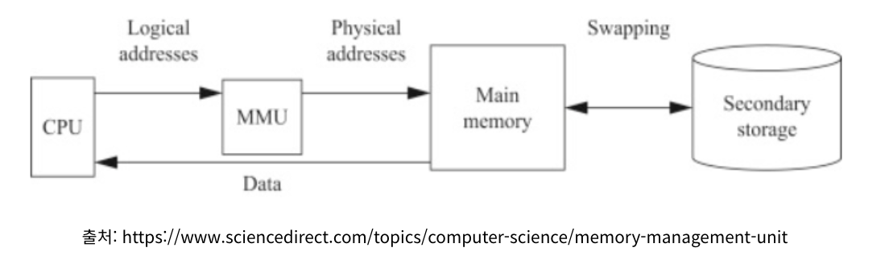
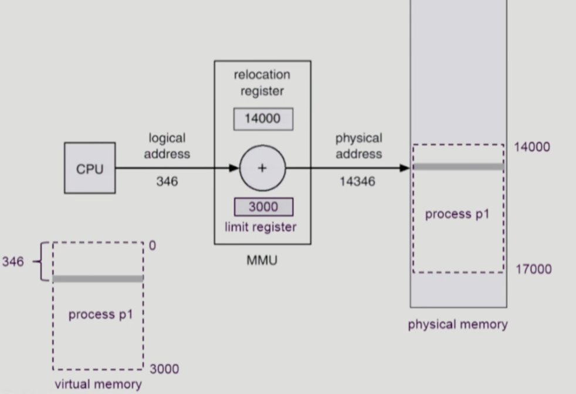
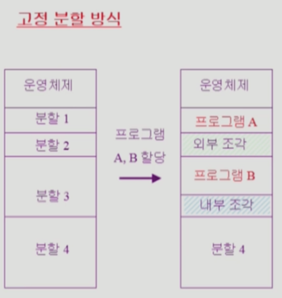
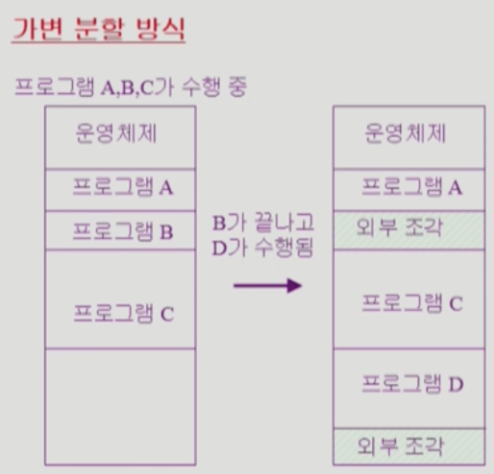
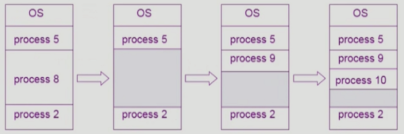

### TL;DR

- 메모리 관리의 목적과 역사
- Logical and Physical Address
- Address Binding
- MMU (Memory Management Unit)
- Contiguous allocation
- Fragmentation (외부단편화, 내부단편화)

## 메모리 관리의 목적

**1. 쉽게 메모리를 사용할 수 있도록 추상화를 제공**

- 운영체제의 목적 중 하나는 컴퓨터 시스템을 **편리하게 사용할 수 있는 환경 제공한다.**
- 이러한 맥락에서 메모리 관리는 프로그래머가 쉽게 메모리를 관리할 수 있게 한다.

**2. 적은 오버헤드로 성능을 최대한 이끌어낼 수 있도록 프로세스 간 부족한 메모리 자원을 적절히 할당**

- 만약 램이 8GB이고 프로그램이 10GB의 메모리가 필요한 상황에서 메모리 관리 기능을 통해 프로그램 수행을 가능하게 한다.

**3. 메모리 보호 기능**

- 다른 프로세스가 본인 프로세스 외의 영역을 침범하지 못하도록 한다.

## 메모리 관리의 역사

**1. Batch Programming**

- Batch 프로그래밍 시절에는 메모리 관리가 필요하지 않았다.
- 프로세스 하나를 메모리에 로드하고, 해당 프로세스가 다 수행되고 나면 다른 프로세스를 올리는 방식이 Batch System이기 때문이다.

**2. Multi-Programming**

- 한 번에 여러 프로세스가 메모리에 올라가게 되면서 메모리 관리가 중요해졌다.
- Multi-Programming이 등장하면서 메모리 보호, Fast Translation이 필요해졌다.
- 이번 장에서 다룰 내용도 1960년대, 70년대 초반에 정립된 내용이다.

## Logical and Physical Address

- 가상 메모리 주소 (Logical Address = Virtual Address)

각 프로세스마다 독립적으로 가지는 주소 공간이다. 주소가 0부터 시작한다. CPU가 바라보는 주소는 Logical Address이다.

- 물리 메모리 주소 (Physical Address)

물리 메모리가 실제 올라가는 위치이다.

- 주소 바인딩

각 프로세스마다 논리적 주소는 0번부터 시작하기 때문에 물리 메모리에 올라가기 위해서는 가상 메모리 주소가 물리 메모리 주소로 바뀌는 과정이 필요하다. 이 과정을 **주소 바인딩**이라고 한다. 주소 바인딩이 일어나는 시점에 따라 Compile Time Binding, Load Time Binding, Execution Time Binding으로 나뉜다.

## Address Binding

**1. Compile Time Binding**

- Physical Address가 컴파일 시 결정되며, 시작 위치 변경 시 다시 컴파일 과정을 거쳐야한다.
- 과거 시스템 내에 하나의 프로그램이 실행될 때 사용되었으며 최근의 시스템에서는 사용하지 않는다.

**2. Load Time Binding**

- 소스 코드가 컴파일되어 Logical Address만 결정되고 메모리에 올라갈 때 Physical Address가 결정되는 방식이다.
- Loader의 책임하에 Physical Address를 부여하여 컴파일러가 재배치 가능한 코드를 생성한 경우에 가능하다.

**3. Execution Time Binding**

- Load time binding처럼 physical address가 프로그램 실행시에 결정된다.
- 차이점은 수행이 시작된 이후에도 프로세스의 메모리 상 위치를 옮길 수 있다는 점이다.
- CPU가 주소를 참조할 때마다 binding을 점검(address mapping table)하며 하드웨어적인 지원이 필요(base and limit register, MMU)

## MMU (Memory Management Unit)

- CPU 코어안에 탑재되어 CPU가 메모리에 접근하는 것을 관리하는 하드웨어 부품이다.
- **가상 메모리 주소를 실제 메모리 주소로 변환**한다.
- 이외에도 메모리 보호, 캐시 관리 등의 역할을 담당한다.

  

- 기준점의 위치가 다르더라도 offset이 같기 때문에 더하기를 통해 물리적 주소도 논리적 주소처럼 연속적으로 배치된다.
- CPU에 의해 수행되는 프로세스는 주소 값을 생성하며, MMU는 이 모든 주소 값에 대해 Base Register(Relocation Register)의 값을 더한다.
- 가상 메모리상의 Logical Address가 346이라고 할 때, relocation register값을 더한 값이 실제 물리 메모리 주소가 된다.
- Relocation register을 더하기 전에 Logical Address가 limit register보다 더 큰지 검사한다.
- 만약 더 크다면 Memory Protection Fault를 발생시킨다.

  

### Memory Protection Fault

- CPU가 자기 자신한테 인터럽트를 거는 것을 Exception 또는 Trap이라고 부른다.
- Fault 명령어를 사용해 CPU는 운영체제에게 본인은 수행할 수 없는 명령어라고 이야기하면서 운영체제에게 도움을 요청한다.

## Contiguous allocation

: 각각의 프로세스가 메모리의 연속적인 공간에 적재되도록 하는 방식이다.

- **고정 분할 방식**

물리적 메모리를 몇개의 영구적 분할(Partition)로 나누는데, 이 때 분할 크기가 모두 동일한 방식과 서로 다른 방식이 존재한다. 분할당 하나의 프로그램이 적재된다.

해당 방식은 융통성이 없다는 단점을 갖는다. 동시에 메모리에 로드되는 프로그램 수가 고정되며, 내부 단편화와 외부 단편화가 발생한다.

  

- **가변 분할 방식**

프로그램의 크기를 고려하여 Partition을 할당한다. 분할의 키기와 개수가 동적으로 변한다. 사용후 반납된 메모리를 관리하는 등의 필요가 발생하기 때문에 기술적 관리 기법이 필요하다. 외부 단편화가 발생한다.

  

- **Hole**

물리 메모리 상의 가용 메모리 공간이다. 다양한 크기의 Hole들이 메모리의 여러 공간에 걸쳐 흩어져있다. 프로세스가 메모리에 적재되어야하는 순간에 수용가능한 Hole에 프로세스를 할당한다. 운영체제는 할당 공간이나 가용 공간의 정보를 유지해야한다.

  

- **프로세스를 어떤 Hole에 할당해야할까?**

Dynamic Storage Allocation Problem으로 Size가 N인 요청을 만족하는 가장 적절한 Hole을 찾는 문제이다.

1. First-fit : size가 n 이상인 것 중 최초로 찾아지는 Hole에 할당
2. Best-fit : size가 n 이상인 가장 작은 Hole에 할당. 모든 Hole List를 탐색해야함.
3. Wort-fit : 가장 큰 Hole에 할당. 모든 Hole List를 탐색해야함.

- **Compaction**

외부 단편화(필요한 작업 메모리보다 많은 메모리 공간을 갖고 있음에도 프로세스를 받아 들이지 못하는 상황)를 해결하는 하나의 방법이다. 사용 중인 메모리 영역을 한 쪽에 몰아놓고 큰 가용 공간을 확보한다. 매우 비용이 많이 드는 방법이고 복잡한 방법이다. 이는 메모리 바인딩이 Run Time Binding이 가능한 경우에만 수행이 가능하다.

## Fragmentation

: RAM에서 사용가능한 메모리가 충분히 존재하지만 할당(사용)이 불가능한 상태이다.

- **내부 단편화**

: 메모리를 할당할 때 **프로세스가 필요한 양보다 더 큰 메모리가 할당되어서** 프로세스에서 사용하는 메모리 공간이 낭비 되는 상황이다.

- **외부 단편화**

: 메모리가 할당되고 해제되는 작업이 반복되면 중간중간에 생긴 사용하지 않는 메모리가 많이 존재하게 된다. 이러한 이유로 총 메모리 공간은 충분하지만 실제로 할당할 수 없는 상황이 발생한다. 이를 외부 단편화라고 한다.

각각의 단편화를 해결하기 위해서는 세그멘테이션 기법과 페이징 기법이 존재한다. 이에 대해서는 다음 포스팅에서 다루려 한다.

## reference

- [jhnyang.tistory 글의 Chapter 8 메모리 관리](https://jhnyang.tistory.com/notice/31)
- [인프런 운영체제 공룡책 강의](https://www.inflearn.com/course/%EC%9A%B4%EC%98%81%EC%B2%B4%EC%A0%9C-%EA%B3%B5%EB%A3%A1%EC%B1%85-%EC%A0%84%EA%B3%B5%EA%B0%95%EC%9D%98/lecture/63005?tab=curriculum)
- [반효경 교수님 운영체제 강의](http://www.kocw.net/home/search/kemView.do?kemId=1046323)
- [반효경 교수님 운영체제 강의 정리 블로그 글](https://kosaf04pyh.tistory.com/245?category=1032510)
