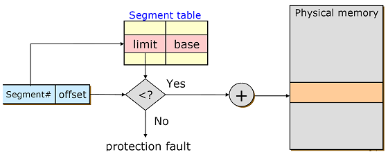

### TL;DR

- NonContiguous Allocation
- Paging
- Transition Lookaside Buffer
- Segmentation

## NonContiguous Allocation

: 하나의 프로세스가 메모리의 여려 영역에 분산되어 적재되는 방식

- Paging : 논리 주소를 고정된 페이지라고 불리는 블록으로 분할 관리하는 방법
- Segmentation : Process의 가상 메모리를 논리적단위인 Segment로 분할 관리하는 방법
- Paged Segmentation : Paging과 Segmentation을 혼용하는 방식이다.

## Paging

: **논리 주소를 고정된 페이지**라고 불리는 블록으로 분할 관리하는 방법이며, 각각의 페이지는 **물리 메모리의 프레임**과 매핑된다.

### **Paging은 어떤 문제를 해결하는가?**

Contiguous Allocation의 외부 단편화 문제를 해결한다. 프로세스를 연속으로 할당하면 외부 단편화가 발생할 수 있다. 프로세스가 필요한 메모리의 크기가 Hole보다 커서 못들어갈 수 있고, 적절한 Hole의 크기를 찾는 것도 문제가 된다.

### **Paging은 어떻게 문제를 해결하는가?**

Logical Address를 동일한 크기로 자른다. 이 때 Physical Address도 동일한 크기로 자른다. 프로세스의 Logical Address가 Physical Address의 어느 위치에 존재해야하는지를 관리하는 기법을 사용해 메모리를 연속적으로 적재할 필요를 해소시킨다.

### **Paging이 해결하지 못하는 문제**

외부 단편화는 해결하지만 내부 단편화는 해결하지 못한다. 고정된 크기(대부분 4KB)로 가상 메모리를 나누는데 당연히 프로세스가 필요한 메모리의 크기가 4KB일수 없기 때문이다.

  

- CPU가 보는 logical address는 physical address상의 주소로 변환되어야 하며, 이 변환 과정에서 page table을 사용한다.
- logical address에서 앞 부분의 p는 페이지 번호, 뒷 부분d는 페이지 내의 offset이 된다.
- page table에서는 페이지 번호를 사용하여 프레임 번호(f)를 찾아서 physical address를 구할 수 있다.

## TLB (Transition Lookaside Buffer)

: 일종의 Page Table의 Cache

- page table에 의해 logical address를 physical address로 매핑을 하면 실제 물리 메모리의 주소에 접근하여 연산을 한다. 이런 경우 실제 데이터를 연산하는데 page table 접근 1번, 물리 메모리의 data/instruction 접근 1번 총 2번의 물리 메모리 접근을 하게 된다. 속도 향상을 위해 cpu와 물리 메모리 사이에 cache를 두어 page table에서 자주 참조되는 entry를 caching한다.

**TLB 동작 방식**

- logical address를 physical address를 변환하기 전에 물리 메모리의 page table을 보기 전에 먼저 TLB를 본다.
- p에 대항하는 페이지 번호가 caching되어 있으면(TLB hit) 바로 주소변환을 해서 물리 메모리에 접근한다. 그렇지 않은 경우(TLB miss) 일반적인 경우처럼 page table을 사용하여 주소변환 후 물리 메모리에 접근한다.
- page table은 각 프로세스마다 존재하므로 TLB 프로세스가 교체될 때마다(context switch) 모든 엔트리 정보를 제거해야 한다.

**주소 매핑을 위해 사용하는 2가지 Register**

- **Page Table Base Register(PTBR)** : relocation register 역할을 하며 page table을 가리킨다.
- **Page Table Length Register(PTLR)** : limite register 역할을 하며 테이블 크기를 저장한다.

  

## Segmentation

: 논리 주소를 **논리적 내용 단위인 세그먼트**로 잘라서 관리하는 방법

- 세그멘테이션은 프로세스를 세그먼트의 집합으로 생각한다.
- 세그먼테이션은 물리적인 크기의 단위가 아닌 논리적 내용의 단위(의미가 같은)로 자르기 때문에 세그먼트들의 크기는 일반적으로 같지 않다.
- [세그메인테이션은 논리적인 단위로 나뉘기 때문에 **보호와 공유의 기능을 수행하기 쉬워진다.**](https://copycode.tistory.com/108)

### 메모리 할당 방식

- 메모리에 할당하는 방법에 대해서는 페이징과 방법이 같다. MMU 내의 재배치 레지스터를 이용하여 논리 주소를 물리 주소로 바꾸어 주는 방식을 취한다.
- MMU는 세그먼트 테이블로 CPU에서 할당한 논리 주소에 해당하는 물리 주소의 위치를 가지고 있다. 이 방법을 이용하면 CPU는 프로세스가 연속된 메모리 공간에 위치한다고 착각을 하게 된다.

  

### 주소 변환 방식

- 주소를 변환하는 방법 역시 같지만 논리 주소에서 보내는 주소 값에서 하위 변위 비트를 제외한 앞의 비트들은 페이징 번호가 아니라 세그먼트 번호가 된다.
- **논리 주소는 세그먼트 번호와 변위 비트로 이루어져 있게 된다**. 세그먼트 테이블에 논리 주소 값이 들어가게 되면 세그먼트 번호는 세그먼트 테이블의 인덱스 값으로 인식을 하게 된다.
- 세그먼트 번호를 토대로 테이블 내용으로 들어가 **시작 위치 및 한계 값을 파악**한다. 물리 주소는 세그먼트 테이블에 있는 시작 위치와 변위 값을 합하여 구할 수 있다.
- 주소 값이 한계(각 세그먼트의 크기)를 넘어서면 segment violation 예외 상황 처리를 하게 된다. 이런 경우는 변위가 한계보다 크면 발생한다.

### Segmentation**이 해결하지 못하는 문제**

- 세그먼트는 크기가 고정되어 있지 않고 가변적이다. 크기가 다른 각 세그먼트를 메모리에 두려면 동적 메모리 할당을 해야 하고 이 경우에는 외부 단편화가 발생할 수 있다.
- 외부 단편화는 메모리 낭비를 매우 크게 발생시킨다. 이러한 이유로 세그먼테이션은 사용하기 힘들다.

## Segement Paging

- 세그먼테이션은 보호와 공유 면에서 효과적이다.
- 페이징은 외부 단편화 문제 해결에 효과적이다.
- 따라서 세그먼트를 페이징 하는 방법을 취한다.

## reference

- [네이버 블로그 : TLB](https://m.blog.naver.com/PostView.naver?isHttpsRedirect=true&blogId=xowns4817&logNo=221182043348)
- [Tistory CopyCode 블로그 : Segmentation](https://copycode.tistory.com/108)
