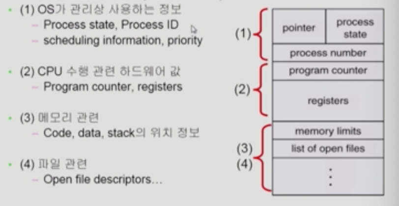
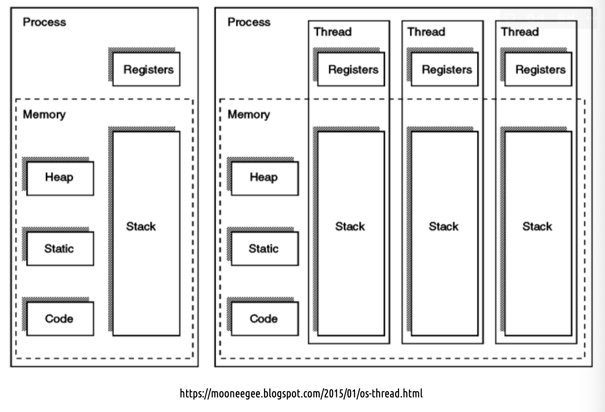

### TL;DR

1. 프로레스
2. 스레드

## 프로세스 (process)

### concepts

프로세스란 운영체제에 의해 메모리 공간을 할당받아 CPU에서 실행/제어되고 있는 프로그램이다. 프로세스는 데이터(data), 자원(memory), 스레드(Thread)로 구성되고, 스레드가 데이터와 자원을 활용해 작업을 수행한다.

프로세스는 프로그램과는 어떻게 다를까? 프로그램은 파일 시스템에 존재하는 실행파일이다. 프로세스는 프로그램을 실행시키는 주체이면서 프로그램의 하나의 인스턴스다. 따라서 프로그램은 하나만 존재하지만 프로세스는 여러 개 존재할 수 있다.

### 프로세스의 상태

프로세스는 보통 6가지 상태 중 하나를 갖는다.

```jsx
												 +------------interrupt------------+
                         v                                 |
+-----+              +-------+                        +----+----+          +------------+
| new +---admitted-->| ready +---scheduler dispatch-->| running +---exit-->| terminated |
+-----+              +-------+                        +----+----+          +------------+
                         ^           +---------+           |
                         +-----------+ waiting |<----------+
         I/O or event completion     +---------+     I/O or event wait
```

- New: 프로세스가 처음 생성되었을 때.
- Ready: 프로세스가 프로세서에 할당되기를 기다릴 때.
- Running: 프로세스가 할당되어 실행될 때.
- Blocked: 프로세스가 이벤트를 기다릴 때.
- Terminated: 프로세스가 실행을 마쳤을 때.
- Suspended: 외부적인 이유로 프로세스가 얼어붙은 상태. Suspend/Blocked와 Suspended/Ready 상태로 나뉠 수 있는데, 만약 I/O같은 작업이 진행 중인 경우에는 Suspended/Blocked에서 Suspended/Ready 상태로 바뀔 수 있다.

### Process Control Block (PCB)

운영 체제 커널의 자료 구조이며, 프로세스 제어를 위해 필요한 정보를 포함한다. 이는 프로세스 상태 관리와 Context Switching을 위해서 필요하다. PCB에는 다음과 같은 정보가 담겨 있다.

- Process state: 프로세스의 상태
- Program Counter: 해당 프로세스가 이어서 실행해야 할 명령의 주소를 가리키는 카운터
- CPU Registers: 프로세스가 `인터럽트` 후 올바르게 작업을 이어가기 위해 참조하는 CPU 레지스터 값
- CPU-scheduling information: 프로세스의 중요도, 스케줄링 큐 포인터 등 스케줄링 파라미터 정보.
- Memory-management information: base, limit 레지스터 값, 페이지 테이블 등 메모리 시스템 정보.
- Accounting information: 사용된 CPU 총량, 프로세스 개수, 시간 제한 등.
- I/O status information: 프로세스에 할당된 입출력 장치 목록, 열린 파일 목록 등.

<div align="center">
  
</div>

## 스레드 (threads)

스레드는 **프로세스의 실행 단위**이다. 하나의 프로세스가 **한 번에 하나의 작업만 수행하는 것은 싱글스레드**(Single thread)이며, 하나의 프로세스가 **동시에 여러 작업을 수행하는 것은 멀티스레드**(Multi thread)라고 한다.

### Concepts

스레드는 프로세스 내에서 각각 Stack만 할당받고, Code, Data, Heap 영역은 공유한다. 프로세스내의 주소공간이나 자원 등과 같은 프로세스 내에 스레드끼리 공유하면서 실행된다. 같은 프로세스 안에 있는 여러 스레드들은 같은 힙 공간을 공유한다.
하나의 스레드가 별도로 갖는 정보에 대해서 좀 더 자세하게 알아보자. 스레드는 별도의 스택, 프로그램 카운터, 레지스터 셋을 갖는다.

- 스택

스택은 함수 호출 시 전달되는 인자, 되돌아갈 주소 값 및 함수 내에서 선언하는 변수 등을 저장하기 위해 사용되는 메모리 공간이다. 스택 메모리 공간이 독립적이라는 것은 독립적인 함수 호출이 가능하다는 의미이며 이는 독립적인 실행 흐름이 추가되는 것을 의미한다. 따라서 독립적인 실행 흐름을 추가하기 위한 최소 조건으로 독립된 스택을 할당한다.

- 프로그램 카운터 (Program Counter)

스레드가 명령어의 어디까지 수행하였는지를 나타낸다. 스레드는 CPU를 할당받았다가 스케줄러에 의해 다시 CPU를 빼앗긴다. 따라서 명령어가 연속적으로 수행되지 못하고 이 때 어느 부분까지 수행되었는지를 기억해야한다. 따라서 PC를 독립적으로 할당한다.

### 스레드 사용의 장점

멀티 스레딩은 하나의 프로세스를 다수의 실행 단위로 구분하여 자원을 공유하고 자원의 생성과 관리의 중복성을 최소화하여 수행 능력을 향상시키는 것이다. 멀티 스레딩의 장점과 단점에 대해서 알아보자.

1. 메모리 절약

스레드는 프로세스에 비해 점유하는 물리 메모리의 크기가 훨씬 적다. 그래서 스레드를 **경량 프로세스**라고도 부른다.

2. 프로세스 콘텍스트 스위칭에 비해 오버헤드 절감

멀티 프로세스로 실행되는 작업을 멀티 스레드로 실행하게 되면 프로세스를 생성하여 자원을 할당하는 과정도 줄어들뿐더러 프로세스를 콘텍스트 스위칭(Context Switching)하는 것보다 오버헤드를 더 줄일 수 있게 된다.

3. 작업들 간의 통신 비용 절감

두 프로세스가 만약 하나의 데이터를 공유하려면 메시지 패싱이나 공유 메모리 또는 파이프를 사용해야 한다. 이는 효율도 떨어지고 구현 및 관리하기도 번거롭다. 따라서 하나의 프로세스 내에서 자원을 공유하는 스레드를 사용한다면 여러 개의 프로세스를 사용할 때보다 비용을 절감할 수 있다.

### 스레드 사용의 단점

1. 하나의 스레드에 문제가 생기면 전체 프로세스가 영향을 받는다.
2. 동기화가 필요하고 과도한 동기화는 병목현상과 교착상태의 문제를 유발할 수 있다.

### 스레드와 프로세스의 차이점

프로세스는 완전히 독립적이기 때문에 메모리 영역을 다른 프로세스와 공유하지 않는다. 하지만 스레드는 해당 스레드를 위한 스택을 생성할 뿐 프로세스 내의 메모리를 공유해서 사용한다.

<div align="center">
  
</div>

## reference

- [tistory: 프로세스와 스레드](https://beststar-1.tistory.com/6)
- [프로그램과 프로세스의 차이](https://jhnyang.tistory.com/6)
- [공룡책으로 정리하는 운영체제 Ch.4](https://parksb.github.io/article/8.html)
